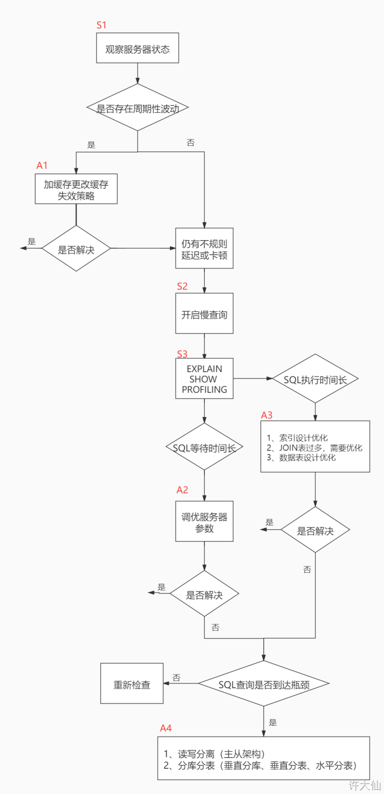
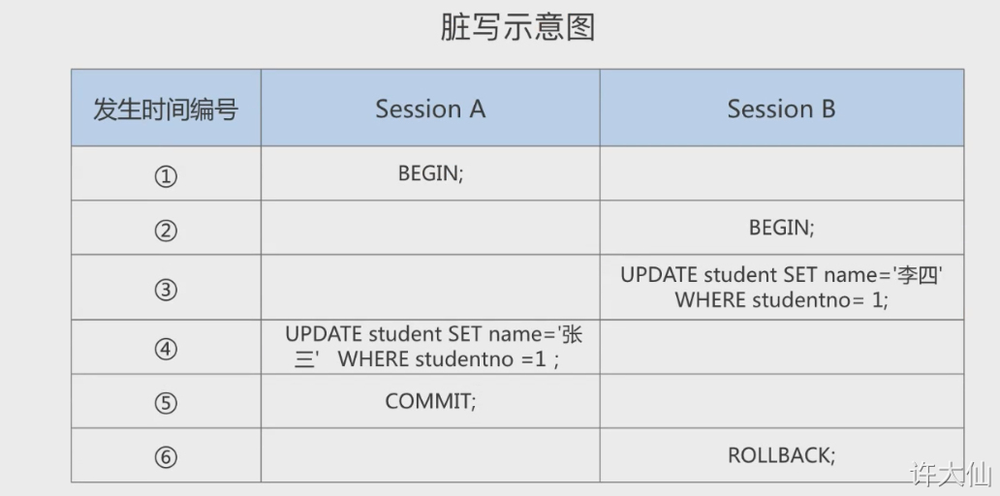
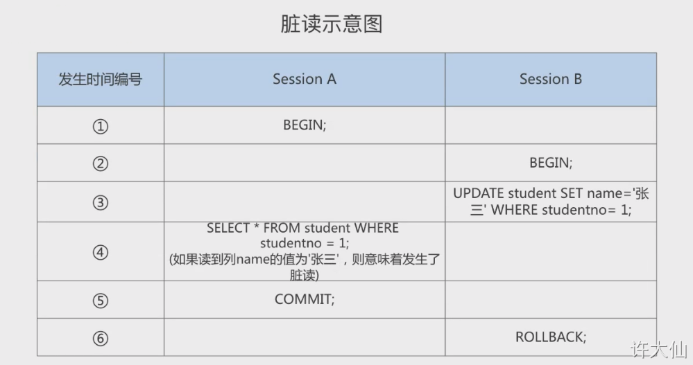
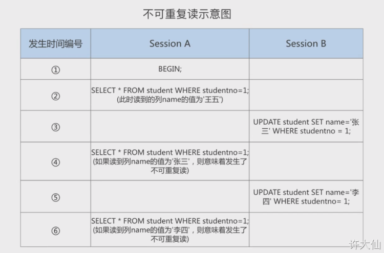
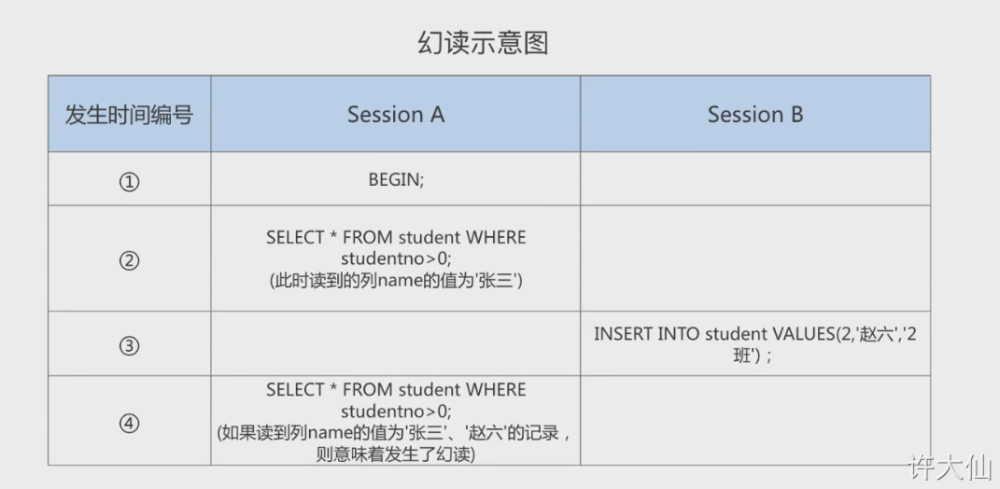
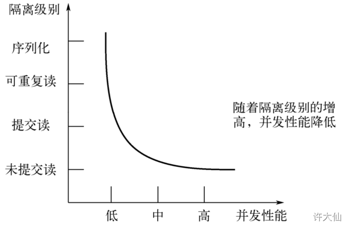
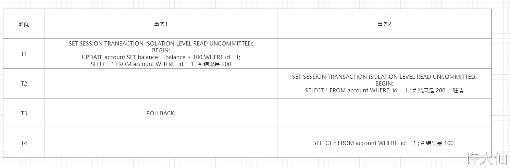

**SQL分类**
```text

1. DDL:
    a. 这些语句定义了不同的数据库、表、视图、索引等数据库对象，还可以用来创建、删除、修改数据库和数据表的结构。
    b. 主要的语句关键字包括 CREATE、DROP、ALTER 等。

2. DML: 
    a. 用于添加、删除、更新和查询数据库记录，并检查数据完整性。
    b. 主要的语句关键字包括 INSERT、DELETE、UPDATE、SELECT 等。
    c. SELECT 是 SQL 语言的基础，最为重要。

3. DCL:
    a. 用于定义数据库、表、字段、用户的访问权限和安全级别。
    b. 主要的语句关键字包括 GRANT、REVOKE、COMMIT、ROLLBACK、SAVEPOINT 等。

注：
    因为查询语句使用的非常频繁，所以很多人将查询语句单独划分为一类：DQL（数据查询语言）。
    还有单独将 COMMIT、ROLLBACK 单独划分为一类的称为 TCL（Transaction Control Language，事务控制语言）。

```
**WHERE 和 HAVING 的对比**
```text

区别一：
    1. WHERE 可以直接使用表中的字段作为筛选条件，但是不能使用分组中的计算函数作为筛选条件；HAVING 必须要和 GROUP BY 配合使用，可以将分组计算的函数和分组字段作为筛选条件。
    2. 这就决定了，在需要对数据进行分组统计的时候，HAVING 可以完成 WHERE 不能完成的任务。因此，在查询语法结构中，WHERE 是在 GROUP BY 之前的，所以无法对分组结果进行筛选。HAVING 是在 GROUP BY 之后，可以使用分组字段和分组中的计算函数，对分组的结果集进行筛选，这个功能是 WHERE 无法完成的。另外，WHERE 排除的记录不再包含在分组中。

区别二：
    1. 如果需要通过连接从关联表中获取需要的数据，WHERE 是先筛选后连接，而 HAVING 是先连接后筛选。
    2. 这就决定了，在关联查询中，WHERE 比 HAVING 更高效。因为 WHERE 可以先筛选，用一个筛选后的较小数据集合关联表进行连接，这样占用的资源比较少，执行效率比较高；而 HAVING 则需要先将结果集准备好，也就是用未被筛选的数据集进行关联，然后对这个大的数据集进行筛选，这样占用的资源就比较多，执行效率也比较低。

小结：
    1. WHERE
        a. 优点: 先筛选数据再关联，执行效率高
        b. 缺点：不能使用分组中的计算函数进行筛选
    2. HAVING
        a. 优点：可以使用分组中的计算函数
        b. 缺点：在最后的结果集中进行筛选，执行效率较低

```

**MySQL数据库命令**
```text

创建数据库：
    1. create database 数据库名；
    2. create database 数据库名 character set 字符集；
    3. create database 数据库名 character set 字符集 collate 校验集；
    4. create database if not exists 数据库名 character set 字符集 collate 校验集；
    5. 注意：
        a. DATABASE 不支持改名。如果想改名，就需要先创建一个新的数据库，将数据导入到新的数据库，然后删除旧的数据库。
        b. 如果创建数据库的时候没有指定字符集和校验集，将使用系统默认的字符集和校验集。
            1> CREATE DATABASE IF NOT EXISTS test CHARACTER SET 'utf8mb4' COLLATE 'utf8mb4_general_ci';
    
使用数据库：
    1. 查看当前所有的数据库: show databases   
    2. 查看当前正在使用的数据库: show database()
    3. 查看指定库下所有的表: show tables from 数据库名
    4. 查看数据库的创建信息: show create database 数据库名 （注意：在图形化工具下可能不支持）
    5. 使用/切换数据库： use 数据库名
    
修改数据库：
    1. 更改数据库的字符集： alter database 数据库名 character set 字符集 collate 校验集
    2. 示例： ALTER DATABASE test CHARACTER SET 'utf8mb4' COLLATE 'utf8mb4_general_ci';
    
删除数据库：
    1. drop database 数据库名；
    2. drop database if exists 数据库名


创建表：
    1. create table [if not exists] 表名 (
        字段1, 数据类型 [约束条件] [默认值],
        字段2, 数据类型 [约束条件] [默认值],
        字段3, 数据类型 [约束条件] [默认值]
    )
    
    2. 查看表结构： DESC 表名;
    3. 基于现有的表去创建新的表: create table 表名 AS 子查询;
        a. create table emp1 AS select * from employees;
        b. 创建空表： create table emp1 AS select * from employees where 1 = 2;
    4. 查询数据表结构
        a. DESC 表名;
        b. show create table 表名;

修改表：
    1. 追加一个列（默认添加到表的最后一个字段）： alter table 表名 add column 字段名 数据类型 [first|after 字段名]
    2. 修改一个列（数据类型、长度、默认值以及位置）： alter table 表名 modify column 字段名1 字段类型 [default 默认值] [first|after 字段名]
    3. 重命名： alter table 表名 change column 列名 新列名 新数据类型
    4. 删除一个列： alter table 表名 drop column 字段名；


表重命名：
    1. rename table 表名 to 新表明;
    2. alter table 表名 rename to 新表明
    
删除表：
    1. drop table [if exists] 表名1[,表名2...]


截断表：
    1. truncate table 表名;
    2. 注意：
        a. 截断表将删除表中的所有数据，但是表结构保留。
        b. TRUNCATE 语句不能回滚，应该使用 DELETE 语句删除数据，并且 DELETE 语句是可以回滚的。

MySQL 8 新特性 --- DDL 原子化
    1. 在 MySQL 8.0 版本中，InnoDB 表的 DDL 支持事务完整性，即 DDL 操作要么成功要么回滚 。DDL 操作回滚日志写入到 data dictionary 数据字典表 mysql.innodb_ddl_log（该表是隐藏的表，通过 show tables 无法看到） 中，用于回滚操作。通过设置参数，可将DDL操作日志打印输出到MySQL错误日志中。
    2. 演示在 MySQL 5.7 下没有 DDL 原子化： 
    
    在8中，如果删除数据库中一个存在的表和一个不存在的表，那么执行报错，存在的表也不会被删除，而在5中则会被删除。

```

**MySQL中的数据类型**
```text

1. 整数类型
2. 浮点类型
3. 定点数类型
4. 位类型
5. 日期时间类型
6. 文本字符串类型
7. 枚举类型
8. 集合类型
9. 二进制字符串类型
10. JSON类型
11. 空间数据类型

```

**MySQL中的约束**
```text
1. 非空约束 
    a. 列值不能为空： NOT NULL 
    
2. 唯一性约束
    a. 列值允许为空，但不能重复： UNIQUE
    b. 唯一约束可以是某一列的值唯一，也可以是多个列组合的值唯一。
    c. 在创建唯一约束的时候，如果不给唯一约束命名，就默认和列名相同。
    d. 添加唯一约束时会自动给列添加一个唯一索引
    e. 删除唯一约束只能通过删除唯一索引的方式删除。
    
3. 主键约束（PRIMARY KEY 约束）
    a. 用来唯一标识表中的一行记录。 
    b. 主键约束相当于唯一约束 + 非空约束的组合，主键约束不允许重复，也不允许出现空值
    c. 一个表最多只能有一个主键约束，建立主键约束可以在列级别创建，也可以在表级别创建。
    d. 主键约束对应着表中的一列或多列（复合主键）。
    e. 如果是多列组合的复合主键约束，这些列都不允许出现空值，并且组合的值也不允许重复。
    f. MySQL 的主键名总是 PRIMARY，就算自己命名了主键约束名也没有用。
    g. 当创建主键约束的时候，系统默认会在所在的列或列组合上建立对应的主键索引（能够根据主键查询的，就根据主键查询，效率更高）。如果删除了主键约束，主键约束对应的索引就自动删除。
    
    删除主键约束：
        1> ALTER TABLE 表名称  DROP PRIMARY KEY;
        2> ALTER TABLE emp5 DROP PRIMARY KEY;
        

4. 自增约束（AUTO_INCREMENT）
    a. 用于某个字段的值自增。
    b. 一个表最多只能有一个自增长列
    c. 当需要产生唯一标识或顺序值的时候，可以设置自增长。
    d. 自增长列约束的列必须是键列（主键列或唯一键列）。
    e. 自增约束的列的数据类型必须是整数类型。
    f. 如果自增列指定了 0 和 NULL，会在当前最大值的基础上自增；如果自增列手动指定了具体的值，直接赋值为具体的值。

5. 外键约束（FOREIGN KEY）
    a. 限定某个表中的某个字段的引用完整性。例如：员工表的员工所在的部门，必须在部门表中能找到对应的部门。
    b. 从表的外键列，必须引用（参考）主表的主键或唯一约束的列，因为被依赖（被参考）的值必须是唯一的。
    c. 在创建外键约束的时候，如果不给外键约束命名，默认不是列名，而是自动产生一个外键名，当然也可以手动指定外键约束名。
    d. 创建表就指定外键约束的话，必须先创建主表，再创建从表。
    e. 删除表的时候，必须先删除从表（或先删除外键约束），再删除主表。
    f. 在从表中指定外键约束，并且一个表中可以建立多个外键约束。
    g. 从表的外键列和主表被参照的列名可以不同，但是数据类型必须一致，逻辑意义一样；如果类型不一样，创建子表的时候，MySQL 会报错
    h. 当创建外键约束的时候，系统默认会在所在的列上建立对应的普通索引。
    i. 删除外键约束后，必须手动删除对应的索引。
    
6. CHECK 约束

7. DEFAULT 约束

```

**MySQL视图**
```text
    
视图的理解:
    1. 视图就是一种虚拟表，本身是不具有数据的，占用很少的内存空间，它是 SQL 中的一个重要概念。
    2. 视图建立在已有的表的基础上，视图来意建立的表称为基表
    3. 视图的创建和删除只会影响视图本身，不会影响对应的基表。但是当对视图中的数据进行增加、删除和修改操作的时候，数据表中的数据会相应的发生变化，反之亦然。
    4. 向视图提供内容的语句是 SELECT 语句，可以将视图理解为存储起来的 SELECT 语句。 
    5. 视图是向用户提供基表数据的另一种表现形式。通常情况下，小型项目的数据库可以不使用视图，但是在大型项目中以及数据表比较复杂的情况下，视图的价值就凸显出来了，它可以帮助我们将经常查询的结果集放到虚拟表中，提升了使用效率，理解和使用起来都非常方便。
    
    
创建视图：
    1. create view 视图名 [(字段列表)] AS 查询语句；
    
查看视图：
    1. SHOW TABLES;
    
查看视图的结构：
    1. DESC view_emps;
    
总结：
    1. 虽然可以更新视图数据，但是总的来说，视图作为虚拟表，主要用于方便查询，不建议更新视图中的数据。
    2. 对视图数据的更改，都是通过对实际数据表里数据的操作来完成的。
  
修改视图：
    1. alter view 视图名称 as 查询语句
    
删除视图：
    1. drop view if exists 视图名称；
    2. drop view if exists 视图1,视图2...
    
    
视图的优点与缺点：
    优点：
        1. 操作简单：将经常使用的查询操作定义为视图，可以使开发人员不需要关心视图对应的数据表的结构、表与表之间 的关联关系，也不需要关心数据表之间的业务逻辑和查询条件，而只需要简单地操作视图即可，极大简化了开发人员对数据库的操作。
        2. 减少数据冗余：视图跟实际数据表不一样，它存储的是查询语句。所以在使用的时候，我们要通过定义视图的查询语句来获取结果集。而视图本身不存储数据，不占用数据存储的资源，减少了数据冗余。
        3. 数据安全：MySQL 将用户对数据的访问限制在某些数据的结果集上，而这些数据的结果集可以使用视图来实现。用户不必直接查询或操作数据表。这也可以理解为视图具有隔离性 。视图相当于在用户和实际的数据表之间加了一层虚拟表。同时，MySQL 可以根据权限将用户对数据的访问限制在某些视图上，用户不需要查询数据表，可以直接通过视图获取数据表中的信息。这在一定程度上保障了数据表中数据的安全性。
        4. 适应灵活多变的需求：当业务系统的需求发生变化后，如果需要改动数据表的结构，则工作量相对较大，可以使用视图来减少改动的工作量。这种方式在实际工作中使用得比较多。
        5. 能够分解复杂的查询逻辑：数据库中如果存在复杂的查询逻辑，则可以将问题进行分解，创建多个视图获取数据，再将创建的多个视图结合起来，完成复杂的查询逻辑。
    缺点：
        1. 如果我们在实际数据表的基础上创建了视图，那么，如果实际数据表的结构变更了，我们就需要及时对相关的视图进行相应的维护。特别是嵌套的视图（就是在视图的基础上创建视图），维护会变得比较复杂， 可读性不好 ，容易变成系统的潜在隐患。因为创建视图的 SQL 查询可能会对字段重命名，也可能包 含复杂的逻辑，这些都会增加维护的成本。
        2. 实际项目中，如果视图过多，会导致数据库维护成本的问题。
        3. 所以，在创建视图的时候，你要结合实际项目需求，综合考虑视图的优点和不足，这样才能正确使用视 图，使系统整体达到最优。
```

**MySQL存储过程**
```text

创建存储过程：
    1. create procedure 存储过程名称 (IN|OUT|INOUT 参数名 参数类型) [characteristics]  begin // 存储过程体 end 

调用存储过程：
    1. CALL 存储过程()

```

**存储函数**
```text

语法：
    1. create function 函数名(参数名 参数类型,...) rerurns 返回值类型 [characteristics...] begin 函数体 end 

调用函数：
    1. select 函数()

```


**MySQL服务器结构**
```text

1. 连接层
    a. 负责认证
    b. 管理连接
    c. 获取权限信息
    
2. 服务层
    a. SQL Interface：SQL 接口
        1> 接收用户的 SQL 命令，并且返回用户需要查询的结果。如：SELECT ... FROM ... 就是调用 SQL Interface 。
        2> MySQL 支持 DML（数据操作语言）、DDL（数据定义语言）、存储过程、存储函数、视图、触发器等多种 SQL 语言接口。
        
    b. Parser：解析器
        1> 在解析器中对 SQL 语句进行语法分析、语义分析。将 SQL 语句分解成数据结构，并将这个结构传递到后续步骤，以后 SQL 语句的传递和处理就是基于这个结构的。如果在分析构成中遇到错误，那么就说明这个 SQL 语句是不合理的。
        2> 在 SQL 命令传递到解析器的时候会被解析器验证和解析，并为其创建语法树，并根据数据字典丰富查询语法树，会验证该客户端是否具有执行该查询的权限。创建好语法树之后，MySQL 还会对 SQL 查询进行语法上的优化，并进行查询重写。
        
    c. Optimizer：查询优化器
        1> SQL 语句在语法解析之后、查询之前会使用查询优化器确定 SQL 语句的执行路径，生成一个执行计划（Explain）。
        2> 这个执行计划表明应该使用哪些索引进行查询（全表检索还是使用索引检索），表之间的连接顺序如何，最后会按照执行计划中的步骤调用存储引擎提供的方法来进行真正的查询操作，并将查询结果返回给用户。
        3> 它使用选取-投影-连接的策略进行查询。类似于下面的查询语法(SELECT id,name FROM student WHERE gender = '女';)：
            1) 这个 SELECT 查询先根据 WHERE 语句进行选取，而不是将表全部查询出来以后在进行 gender 过滤。
            2) 这个 SELECT 查询会根据 id 和 name 进行属性投影，而不是将属性全部取出以后再进行过滤。
            3) 最后，将上述两个查询条件连接起来生成最后的查询结果。
    
    d. Caches & Buffers：查询缓存组件 (MySQL8中将其删除)
    
3. 引擎层
    a. 和其它数据库相比，MySQL 有点与众不同，它的架构可以在多种不同的场景中应用并发挥良好作用，主要体现在存储引擎的架构上，插件式的存储引擎架构将查询处理和其他的系统任务以及数据的存储提取相分离（体现了很好的高内聚、低耦合的思想）。这种架构可以根据业务的需求和实际需求选择合适的存储引擎，并且开源的 MySQL 还允许开发人员定制自己的存储引擎。
    b. 这种高效的模块化架构为那些希望专门针对特定应用程序需求（如：数据仓库、事务处理或高可用性等情况）的人提供了巨大的好处，同时享受使用一组独立于任何接口和服务的有着优势的存储引擎。
    c. 插件式存储引擎层（Storage Engines），真正的负责了 MySQL 中数据的存储和提取，对物理服务器级别维护的底层数据执行操作，服务器通过 API 和存储引擎进行通信。不同的存储引擎具有的功能不同，这样我们可与根据自己的实际需求进行选取。

4. 存储层
    a. 所有的数据、数据库、表的定义、表的每一行的内容以及索引，都是存储在文件系统上的，是以文件的方式存在的，并完成和存储引擎的交换。 
    b. 当然，有些存储引擎（如：InnoDB）也支持不使用文件系统直接管理裸设备，但是现代文件系统的实现使得这样做已经没有必要了。
    c. 在文件系统之下，可以使用本地磁盘，也可以使用 DAS、NAS、SAN 等各种存储系统。 

总结：
    1. 连接层：客户端和服务器端建立连接，客户端发送 SQL 到服务器端。
    2. SQL层（服务层）：对 SQL 语句进行查询处理；与数据库文件的存储方式无关。
    3. 存储引擎层：和数据库文件打交道，负责数据的存储和读取。


InnoDB Buffer Pool 工作原理：
    1. 如果缓存池中没有要是用的数据页，那么先从磁盘读取到缓存池中；
    2. 缓存池中的数据发生修改，变成脏页，由于刷盘设置问题，不回实时写入磁盘，到达checkpoint时才会统一写入磁盘；
    3. 如果数据还未刷入磁盘之前宕机，那么会出现数据丢失的情况；
    4. 为了解决这种问题，使用 redo undo 来保证数据有一致性；

```

**MySQL存储引擎**
```text

概述：
    1. 为了管理方便，人们将连接管理、查询缓存、语法解析、查询优化这些不涉及到真实数据存储的功能划分了 MySQL Server 的功能，将真正存取数据的功能划分为 存储引擎 的功能。所以在  MySQL Server完成了查询优化之后，只需要按照生成的执行计划调用底层存储引擎提供的 API，获取到数据后返回给客户端就可以了。
    2. MySQL 中提到了存储引擎的概念。简而言之，存储引擎就是表的类型。其实存储引擎以前叫做表处理器，后来才改名为存储引擎的，其功能就是接收上层传下来的指令，然后对表中的数据进行提取或写入操作。
    3. 存储引擎是负责对表中的数据进行提取和写入工作的，我们可以为不同的表设置不同的存储引擎，也就是说不同的表可以有不同的物理存储结构，不同的提取和写入方式。

设置表的存储引擎
    a. 创建表的时候指定存储引擎: create table 表名 (字段名 字段类型...) engine = 存储引擎名
    b. 修改表的存储引擎: alter table 表名 engine = 存储引擎名


存储引擎介绍：
    1. InnoDB 引擎：具备外键支持功能的事务存储引擎
        a. MySQL 从 3.23.34a 开始就包含 InnoDB 存储引擎。大于等于 5.5 之后，默认采用 InnoDB 引擎。
        b. InnoDB 是 MySQL 的默认事务型引擎，它被设计用来处理大量的短期( short-lived )事务。可以确保事务的完整提交(Commit)和回滚(Rollback)。
        c. 除了增加和查询外，还需要更新、删除操作，那么，应优先选择 InnoDB 存储引擎。
        d. 除非有非常特别的原因需要使用其他的存储引擎，否则应该优先考虑 InnoDB 引擎。
        e. 数据文件结构： 
            1> 表名.frm：存储表结构（MySQL8.0 时，合并在表名.ibd 中） 
            2> 表名.ibd：存储数据和索引。
        f. InnoDB 是为处理巨大数据量的最大性能设计：
            1> 在以前的版本中，字典数据以元数据文件、非事务表等来存储。现在这些元数据文件被删除了。比如：.frm， .par，.trn， .isl，.db.opt 等都在 MySQL8.0 中不存在了。
        g. 对比 MyISAM 的存储引擎，InnoDB 写的处理效率差一些，并且会占用更多的磁盘空间以保存数据和索引。MyISAM 只缓存索引，不缓存真实数据；InnoDB 不仅缓存索引还要缓存真实数据，对内存要求较高，而且内存大小对性能有决定性的影响。

    2. MyISAM 引擎：主要的非事务处理存储引擎
        a. MyISAM 提供了大量的特性，包括全文索引、压缩、空间函数(GIS)等，但 MyISAM 不支持事务、行级锁、外键，有一个毫无疑问的缺陷就是崩溃后无法安全恢复。
        b. 5.5 之前默认的存储引擎，优势是访问的速度快，对事务完整性没有要求或者以 SELECT、INSERT 为主的应用。
        c. 针对数据统计有额外的常数存储。故而 count(*) 的查询效率很高。
        d. 数据文件结构： 
            表名.frm：存储表结构
            表名.MYD：存储数据 (MYData)
            表名.MYI：存储索引 (MYIndex)。
        e. 应用场景：只读应用或者以读为主的业务 

    3. Archive 引擎：用于数据存档
        a. Archive 是归纳的意思，仅仅支持插入和查询两种功能（行被插入后不能再次修改）。
        b. 在 MySQL 5.5 以后支持索引功能。 
        c. 拥有很好的压缩禁止，使用 zlib 压缩库，在记录请求的时候实时的进行压缩，经常被用来作为仓库使用。 
        d. 创建 Archive 表的时候，存储引起会创建以表名开头的文件。数据文件的扩展名为 .ARZ。
        e. 根据英文测试的结论来看，同样数据量下，Archive 表比 MyISAM 表要小大约 75% ，比支持事务处理的 InnoDB 表小大约 83%。
        f. Archive 存储引擎采用了行级锁。该储存引擎支持 AUTO_INCREMENT 列属性。AUTO_INCREMENT 列可以具有唯一索引或非唯一索引，并且尝试在其他列上创建索引会导致错误。
        g. Archive 表适合日志和数据采集（档案）类应用：适合存储大量的独立的作为历史记录的数据，拥有很高的插入速度，但是对查询的支持较差。

    4. Memory 引擎：置于内存的表
        a. 概述：Memory 采用的逻辑介质是内存，响应速度很快，但是当 mysqld 守护进程崩溃的时候数据会丢失。另外，要求存储的数据是数据长度不变的格式，比如，Blob 和 Text 类型的数据不可用(长度不固定的)。
        b. 主要特征
            1> Memory 同时支持哈希（HASH）索引和 B+树索引。
            2> Memory 表至少比 MyISAM 表要快一个数量级。
            3> MEMORY 表的大小是受到限制的。表的大小主要取决于两个参数，分别是 max_rows 和 max_heap_table_size 。其中，max_rows 可以在创建表时指定；max_heap_table_size 的大小默认为 16MB，可以按需要进行扩大。
            4> 数据文件与索引文件分开存储。
            5> 缺点：其数据易丢失，生命周期短。基于这个缺陷，选择 MEMORY 存储引擎时需要特别小心。
        c. 使用 Memory 存储引擎的场景： 
            1> 目标数据比较小，而且非常频繁的进行访问，在内存中存放数据，如果太大的数据会造成内存溢出。可以通过参数 max_heap_table_size 控制 Memory 表的大小，限制 Memory 表的最大的大小。
            2> 如果数据是临时的，而且必须立即可用得到，那么就可以放在内存中。
            3> 存储在 Memory 表中的数据如果突然间丢失的话也没有太大的关系。
            
InnoDB 与 MyISAM 对比：
    1. InnoDB
        a. 外键：支持
        b. 事务：支持
        c. 行表锁： 行锁，操作时只锁某一行，不对其它行有影响，适合高并发的操作
        d. 缓存： 不仅缓存索引还要缓存真实数据，对内存要求较高，而且内存大小对性能有决定性的影响
        e. 自带系统表使用： 不支持
        f. 关注点： 事务：并发写、事务、更大资源
        g. 默认安装： Y
        h. 默认使用： Y
    1. MyISAM
        a. 外键：不支持
        b. 事务：不支持
        c. 行表锁： 表锁，即使操作一条记录也会锁住整个表，不适合高并发的操作
        d. 缓存： 只缓存索引，不缓存真实数据
        e. 自带系统表使用： 支持
        f. 关注点： 性能：节省资源、消耗少、简单业务
        g. 默认安装： Y
        h. 默认使用： N


InnoDB表的优势：
    1. InnoDB 存储引擎在实际应用中拥有诸多优势，比如操作便利、提高了数据库的性能、维护成本低等。如果由于硬件或软件的原因导致服务器崩溃，那么在重启服务器之后不需要进行额外的操作。InnoDB 崩溃恢复功能自动将之前提交的内容定型，然后撤销没有提交的进程，重启之后继续从崩溃点开始执行。
    2. InnoDB 存储引擎在主内存中维护缓冲池，高频率使用的数据将在内存中直接被处理。这种缓存方式应用于多种信息，加速了处理进程。
    3. 在专用服务器上，物理内存中高达 80% 的部分被应用于缓冲池。如果需要将数据插入不同的表中，可以设置外键加强数据的完整性。更新或者删除数据，关联数据将会被自动更新或删除。如果试图将数据插入从表，但在主表中没有对应的数据，插入的数据将被自动移除。如果磁盘或内存中的数据出现崩溃，在使用脏数据之前，校验和机制会发出警告。当每个表的主键都设置合理时，与这些列有关的操作会被自动优化。插入、更新和删除操作通过做改变缓冲自动机制进行优化。InnoDB 不仅支持当前读写，也会缓冲改变的数据到数据流磁盘。
    4. InnoDB 的性能优势不只存在于长时运行查询的大型表。在同一列多次被查询时，自适应哈希索引会提高查询的速度。使用InnoDB 可以压缩表和相关的索引，可以在不影响性能和可用性的情况下创建或删除索引。对于大型文本和 BLOB 数据，使用动态行形式，这种存储布局更高效。通过查询 INFORMATION_SCHEMA 库中的表可以监控存储引擎的内部工作。在同一个语句中，InnoDB 表可以与其他存储引擎表混用。即使有些操作系统限制文件大小为 2GB，InnoDB 仍然可以处理。当处理大数据量时，InnoDB兼顾CPU，以达到最大性能。


InnoDB 和 ACID 模型：
    
    1. ACID 模型是一系列数据库设计规则，这些规则着重强调可靠性，而可靠性对于商业数据和任务关键型应用非常重要。MySQL 包含类似 InnoDB 存储引擎的组件，与ACID模型紧密相连，这样出现意外时，数据不会崩溃，结果不会失真。如果依赖 ACID 模型，可以不使用一致性检查和崩溃恢复机制。如果拥有额外的软件保护，极可靠的硬件或者应用可以容忍一小部分的数据丢失和不一致，可以将 MySQL设置调整为只依赖部分 ACID 特性，以达到更高的性能。下面讲解 InnoDB 存储引擎与 ACID 模型相同作用的四个方面。           
    
    2. 原子方面：ACID 的原子方面主要涉及 InnoDB 事务，与 MySQL 相关的特性主要包括： 
        a. 自动提交设置。
        b. COMMIT 语句。
        c. ROLLBACK 语句。
        d. 操作 INFORMATION_SCHEMA 库中的表数据。
    3. 一致性方面： ACID 模型的一致性主要涉及保护数据不崩溃的内部 InnoDB 处理过程，与 MySQL 相关的特性主要包括： 
        a. InnoDB 双写缓存。
        b. InnoDB 崩溃恢复。
    4. 隔离方面： 隔离是应用于事务的级别，与 MySQL 相关的特性主要包括：
        a. 自动提交设置。
        b. SET ISOLATION LEVEL 语句。
        c. InnoDB 锁的低级别信息。
    5. 耐久性方面： ACID 模型的耐久性主要涉及与硬件配置相互影响的 MySQL 软件特性。由于硬件复杂多样化，耐久性方面没有具体的规则可循。与 MySQL 相关的特性有：
        a. InnoDB 双写缓存，通过 innodb_doublewrite 配置项配置。
        b. 配置项 innodb_flush_log_at_trx_commit。
        c. 配置项 innodb_flush_log_at_trx_commit。
        c. 配置项 sync_binlog。
        d. 配置项 innodb_file_per_table。
        e. 存储设备的写入缓存。
        f. 存储设备的备用电池缓存。
        g. 运行 MySQL 的操作系统。
        h. 持续的电力供应。
        i. 备份策略。
        j. 对分布式或托管的应用，最主要的在于硬件设备的地点以及网络情况。


InnoDB 架构:
    1. 缓冲池
        a. 缓冲池是主内存中的一部分空间，用来缓存已使用的表和索引数据。缓冲池使得经常被使用的数据能够直接在内存中获得，从而提高速度。
        
    2. 更改缓存
        a. 更改缓存是一个特殊的数据结构，当受影响的索引页不在缓存中时，更改缓存会缓存辅助索引页的更改。索引页被其他读取操作时会加载到缓存池，缓存的更改内容就会被合并。不同于集群索引，辅助索引并非独一无二的。当系统大部分闲置时，清除操作会定期运行，将更新的索引页刷入磁盘。更新缓存合并期间，可能会大大降低查询的性能。在内存中，更新缓存占用一部分 InnoDB 缓冲池。在磁盘中，更新缓存是系统表空间的一部分。更新缓存的数据类型由 innodb_change_buffering 配置项管理。
        
    3. 自适应哈希索引
        a. 自适应哈希索引将负载和足够的内存结合起来，使得 InnoDB 像内存数据库一样运行，不需要降低事务上的性能或可靠性。这个特性通过 innodb_adaptive_hash_index 选项配置，或者通过 --skip-innodb_adaptive_hash_index 命令行在服务启动时关闭。
        
    4. 重做日志缓存
        a. 重做日志缓存存放要放入重做日志的数据。重做日志缓存大小通过 innodb_log_buffer_size 配置项配置。重做日志缓存会定期地将日志文件刷入磁盘。大型的重做日志缓存使得大型事务能够正常运行而不需要写入磁盘。
        
    5. 系统空间表
        a.  系统表空间包括 InnoDB 数据字典、双写缓存、更新缓存和撤销日志，同时也包括表和索引数据。多表共享，系统表空间被视为共享表空间。
        
    6. 双写缓存
        a. 双写缓存位于系统表空间中，用于写入从缓存池刷新的数据页。只有在刷新并写入双写缓存后，InnoDB 才会将数据页写入合适的位置。
        
    7. 撤销日志
        a. 撤销日志是一系列与事务相关的撤销记录的集合，包含如何撤销事务最近的更改。如果其他事务要查询原始数据，可以从撤销日志记录中追溯未更改的数据。撤销日志存在于撤销日志片段中，这些片段包含于回滚片段中。
        
    8. 每个表一个文件的表空间
        a. 每个表一个文件的表空间是指每个单独的表空间创建在自身的数据文件中，而不是系统表空间中。这个功能通过 innodb_file_per_table 配置项开启。每个表空间由一个单独的 .ibd 数据文件代表，该文件默认被创建在数据库目录中。
        
    9. 通用表空间
        a. 使用 CREATE TABLESPACE 语法创建共享的 InnoDB 表空间。通用表空间可以创建在 MySQL 数据目录之外能够管理多个表并支持所有行格式的表。
        
    10. 撤销表空间
        a. 撤销表空间由一个或多个包含撤销日志的文件组成。撤销表空间的数量由 innodb_undo_tablespaces 配置项配置。
        
    11. 临时表空间
        a. 用户创建的临时表空间和基于磁盘的内部临时表都创建于临时表空间。innodb_temp_data_file_path 配置项定义了相关的路径、名称、大小和属性。如果该值为空，默认会在 innodb_data_home_dir 变量指定的目录下创建一个自动扩展的数据文件。
        
    12. 重做日志
        a. 重做日志是基于磁盘的数据结构，在崩溃恢复期间使用，用来纠正数据。正常操作期间，重做日志会将请求数据进行编码，这些请求会改变 InnoDB 表数据。遇到意外崩溃后，未完成的更改会自动在初始化期间重新进行。
    
```
**索引的数据结构**
```text

B+ 树:
    1. 不论是存放 用户记录 的数据页，还是存放 目录项记录 的数据页，我们都将它们存放到 B+ 树这个数据结构中，所以我们也称这些数据页为 节点。从图中我们可以看出，我们的实际用户记录，其实都是存放在 B+ 树的最底层的节点上的，这些节点也被称为 叶子节点，其余用来存放 目录项 的节点称为 非叶子节点 或者 内节点，其中 B+ 树最上边的那个节点也称为 根节点。
    2. 一个 B+ 树的节点其实可以分为很多层，规定最下边的那层，也就是存放我们用户记录的那层为第 0 层，之后依次往上加。之前我们做了一个非常极端的假设：存放用户记录的页 最多存放 3 条记录，存放目录项记录的页 最多存放 4 条记录。其实，在真实环境中一个页存放的数量是非常大的，假设所有存放用户记录的叶子节点代表的数据页可以存放 100 条用户记录，所有存放目录项记录的节点代表的数据页可以存放 1000 条目录项记录，那么： 
        a. 如果 B+ 树只有 1 层，也就是只有 1 个用于存放用户记录的节点，最多能存放 100 条记录。
        b. 如果 B+ 树有 2 层，最多能存放 1,000 * 100 = 100,000 条记录。
        c. 如果 B+ 树有 3 层，最多能存放 1,000 * 1,000 * 100 = 100,000,000 条记录。
        d. 如果 B+ 树有 4 层，最多能存放 1,000 * 1,000 * 1,000 * 100 = 100,000,000,000 条记录。
```

**常见的索引概念**
```text

1. 索引按照物理实现方式，可以分为：
    a. 聚簇索引（或聚集索引）。
    b. 非聚簇索引（非聚集索引）。

2. 我们有时也会将非聚集索引称为二级索引或者辅助索引。


聚簇索引:
    1. 聚簇索引并不是一种单独的索引类型，而是一种数据存储方式（所有的用户记录都存储在叶子节点），也就是所谓的索引即数据，数据即索引。
    2. 特点：
        a. 使用记录主键值的大小进行记录和页的排序，这包括三个方面的定义： 
            1> 页内 的记录是按照主键的大小顺序排成一个单向链表。
            2> 各个存放 用户记录 的页也是按照页中记录的主键大小顺序排成一个 双向链表。
            3> 存放 目录项记录的页 分为不同的层次，在同一个层次中的页也是根据目录项记录的主键大小顺序排成一个 双向链表。
        b. B+ 树的 叶子节点 存储的是完整的用户记录：所谓完整的用户记录，就是指这个记录中存储了所有列的值（包括隐藏列）。
        
    3. 我们将具有上面两种特性的 B+ 树称为 聚簇索引 ，所有完整的用户记录都存放在这个 聚簇索引 的叶子节点处。这种聚簇索引并不需要我们在 MySQL 语句中显示的通过 INDEX 语句去创建，InnoDB 存储引擎会自动的为我们创建聚簇索引。
    4. 优点：
        a. 数据访问更快，因为聚簇索引将索引和数据保存在同一个 B+ 树中，因此从聚簇索引中获取数据比从非聚簇索引中获取数据更快。
        b. 聚簇索引对于主键的 排序查找 和 范围查询 速度非常快。 
        c. 按照聚簇索引排列顺序，查询显示一定范围数据的时候，由于数据都是紧密相连，数据库不用从多个数据块中提取数据，所以 节省了大量的 I/O 操作 。
    5. 缺点：
        a. 插入速度严重依赖于插入顺序，按照主键的顺序插入是最快的方式，否则将会出现页分裂，严重影响性能。因此，对于 InnoDB 表，一般都会定义一个 自增的 ID 列作为主键 。
        b. 更新主键的代价很高，因此将会导致被更新的行移动。因此，对于 InnoDB 表，一般都是定义为主键不可更新。
        c. 二级索引访问需要两次索引查找，第一次找到主键值，第二次根据主键值找到行数据。
        
    6. 限制：
        a. 对于 MySQL 数据库，目前只有 InnoDB 数据引擎支持聚簇索引，而 MyISAM 并不支持聚簇索引。
        b. 由于数据在物理存储的排序方式只能有一种，所以每个 MySQL 的表只能有一个聚簇索引，通常情况下就是该表的主键。
        c. 如果没有定义主键，InnoDB 会选择 非空的唯一索引 代替。如果没有这样的索引，InnoDB 会隐式的定义一个主键来作为聚簇索引。
        d. 为了充分利用聚簇索引的聚簇的特性，在 InnoDB 表的主键列尽量 选择有序的顺序 ID，而不建议使用无序的 ID ，如：UUID 、MD5、HASH、字符串列作为主键，因为无法保证数据的顺序增长。
        
非聚簇索引（二级索引、辅助索引）:
    1. 上边介绍的 聚簇索引 只能在搜索条件是 主键值 的时候才能发挥作用，因为 B+ 树中的数据都是按照主键进行排序的。那么如果我们想以别的列作为搜索条件，应该怎么办呢？当然是不能从头到尾按照链表依次遍历记录一遍。
    2. 答案就是 多建几棵 B+ 树，不同的 B+ 树中的数据采用不同的排序规则。比如：我们使用 c2 列的大小作为数据页、页中记录的排序规则，再建一棵 B+ 树;
    3. 这个 B+ 树和上边介绍的聚簇索引有如下几处不同：
        a. 使用记录 c2 列的大小进行记录和页的排序，这包括三个方面的含义：
            1> 页内的记录是按照 c2 列的大小顺序排成一个 单向链表 。
            2> 各个存放 用户记录的页 也是根据页中记录的 c2 列的大小顺序排成一个 双向链表。
            3> 目录项记录中不再是 主键 + 页号 的搭配，而变成了 c2列 + 页号 的搭配。
        b. B+ 树的叶子节点存储的并不是完整的用户记录，而是 c2列 + 主键 这两个列的值。
        c. 目录项记录中不再是 主键 + 页号 的搭配，而变成了 c2列 + 页号 的搭配。
    4. 所以，如果我们现在想通过 c2 列的值，查找某些记录的话，就可以使用我们刚刚建立好的这个 B+ 树了。以查找 c2 列的值为 4 的记录为例，查找过程如下：
        a. 确定 目录项记录页 ：根据 根页面 ，也就是 页44 ，可以快速定位到 目录项记录 所在的 页42（因为 2 < 4 < 9 ）。
        b. 根据 目录项记录页 确定用户记录真实所在的页：在 页42 中可以快速定位到实际存储的页，但是由于 c2 列并没有唯一约束，所以 c2 列的值为 4 的记录可能分布在多个数据页中，又因为 2< 4 <= 4 ，所以确定实际存储用户记录的页在 页34 和 页35 中。
        c. 在真实存储用户记录的页中定位具体的记录：其实就是到 页34 和 页35 中定位具体的记录。
        d. 但是这个 B+ 树的叶子节点的记录仅仅存储了 c2 和 c1（c1 就是主键列）两个列，所以我们必须再根据主键值取聚簇索引中再根据主键值查找一遍完整的用户记录，我们称之为 回表 。
        
    
回表：
    1. 我们根据这个以  c2 列大小排序的 B+ 树只能确定我们要查找记录的主键值，所以如果我们想根据 c2 列的值，去查找到完整的用户记录的话，依然需要到 聚簇索引 中再查找以便，这个过程称为 回表 ；换言之，就是根据 c2 列的值查询一条完整记录需要使用 2 棵 B+ 树。
        a. 【问】为什么我们还需要一次 回表 操作？直接将完整的用户记录放到叶子节点不就可以了吗？
        b. 【答】如果将完整的用户记录放到叶子节点是可以不用 回表 的，但是 太占地方 了，相当于每建立一棵 B+ 树都需要将所有的用户记录都拷贝一遍，这就有点浪费存储空间（磁盘空间）了。  
    2.  因为这种按照 非主键列 建立的 B+ 树需要一次 回表 操作才可以定位到完整的用户记录，所以这种 B+ 树也被称为 二级索引（Secondary Index）或者 辅助索引 。由于我们使用的是 c2 列的大小作为 B+ 树的排序规则，所以我们也称这个 B+ 树是为 c2 列建立的索引。
    3. 非聚簇索引的存在不会影响数据在聚簇索引中的组织，所以一张表中可以有多个非聚簇索引。
    
    
聚簇索引 VS 非聚簇索引:
    1. 聚簇索引和非聚簇索引的原理不同，在使用上也有一些区别：
        a. 聚簇索引的 叶子节点 存储的就是我们的 数据记录，非聚簇索引的叶子节点存储的是 数据位置 。非聚簇索引不会影响数据表的物理存储顺序。
        b. 一个表中 只能有一个聚簇索引 ，因为只能有一种排序存储的方式；但是却可以有 多个非聚簇索引 ，也就是多个索引目录提供数据检索。
        c. 使用聚簇索引的时候，数据的 查询效率高，但是如果对数据进行插入、删除、更新等操作，效率会比非聚簇索引低。
    
    
联合索引:
    1. 我们也可以同时以多个列的大小作为排序顺序，也就是同时为多个列建立索引，比如：我们想让 B+ 树按照 c2 和 c3  列的大小进行排序，这个包含两层含义：
        a. 先将各个记录和页按照 c2 列进行排序。
        b. 在记录的 c2 列相同的情况下，采用 c3 列进行排序。
    
    
InnoDB 的 B+ 树索引的注意事项:
    1. 根页面位置万年不动
        a. 我们前边介绍 B+ 树索引的时候，为了方便理解，先将存储用户记录的叶子节点都画出来，然后接着画存储目录项记录的内节点，实际上 B+ 树的形成过程是这样的： 
            1> 每当为某个表创建一个 B+ 树索引（聚簇索引不是人为创建的，默认就有）的时候，都会为这个索引创建一个 根节点 页面。最开始表中没有任何数据的时候，每个 B+ 树索引对应的 根节点 中既没有用户记录，也没有目录项记录。
            2> 随着向表中插入用户记录的时候，先将用户记录存储到这个 根节点 中。
            3> 当根节点中的 可用空间 使用完，继续插入数据的时候，此时会将 根节点 中的所有记录复制到一个新分配的页，如：页a 中，然后对这个页进行 页分裂 操作，得到另一个新页，如：页b。这个时候新插入的记录根据键值（即聚簇索引中的主键值，二级索引中对应的索引列的值）的大小分配到 页a 或 页b 中，而 根节点 便升级为存储目录项记录的页。
        b. 需要注意的是：一个 B+ 树索引的 根节点 自诞生之日起，便不再移动。这样只要我们对某个表建立一个索引，那么它的 根节点 的页号便会记录到某个地方，然后凡是 InnoDB 存储引擎需要用到这个索引的时候，都会从这个固定的地方取出 根节点 的页号，从而来访问这个索引。
    
    2. 内节点（非叶子节点）中目录项记录的唯一性
        a. 索引列 + 主键列 + 页号
    
    
```

**MyISAM 中的索引方案**
```text

B+ 树索引使用存储引擎：
    1. MyISAM: 支持B+ 树索引
    2. InnoDB: 支持B+ 树索引
    3. Memory: 支持B+ 树索引

    4. 即使多个存储引擎支持同一种类型的索引，但是它们的实现原理也是不同的。InnoDB 和 MyISAM 默认的索引是 B+ 树索引，但是 Memory 默认的索引是 Hash 索引。
    5. MyISAM 引擎使用 B+ 树作为索引结构，叶子节点的 data 域存放的是 数据记录的地址 。
    
    
MyISAM 索引的原理:
    1. 我们知道 InnoDB 是索引即数据，数据即索引 的特点，也就是聚簇索引的那棵 B+  树的叶子节点上已经将所有完整的用户记录都包含了，但是 MyISAM 的索引方案虽然也是使用树形结构，但是却是将 索引 和 数据 分开存储：
        a. 如果在数据库A中创建了一个B表，使用InnoDB存储引擎会出现一下两种情况
            1> MySQL 5.x : 会生成两个文件，b.frm (描述表的结构文件，字段长度等) 和 b.ibd文件中（数据 + 索引）
            2> MySQL 8.0 : 会生成一个文件 b.ibd 不在单独提供 b.frm文件
        b. 如果在数据库A中创建了一个B表，使用MyISAM存储引擎会产生以下3个文件:
            1> b.frm (MySQL 5.7) : 描述表的结构文件，字段长度等
            2> b.xxx.sdi (MySQL 8.0) : 描述表结构文件，字段长度等
            3> b.MYD : 数据信息文件
            4> b.MYI : 索引信息文件
            
    2. 将表中记录 按照记录的插入顺序 单独存储到一个文件中，称之为 数据文件。 这个文件并不划分为若干个数据页，有多少记录就往这个文件中塞入多少个记录。由于在插入数据的时候并没有 刻意按照主键大小排序，所以我们并不能在这些数据上使用 二分法 进行查找。
    3. 使用 MyISAM 存储引擎的表会将索引信息存储到一个称为 索引文件 的文件中。 MyISAM 会单独为表的主键创建一个索引，只不过在索引的叶子节点中存储的不是完整的用户记录，而是 主键值 + 数据记录地址 的组合。
    4. 这里假设表一共有 3 列，假设 Col1 是主键，上图是一个 MyISAM 表的主键索引（Primary Key）示意图。可以看出， MyISAM 的索引文件仅仅保存数据记录的地址。在 MyISAM 中，主键索引和二级索引（Secondary Key）在结构上没有任何区别，唯一不同的是：主键索引要求 Key 是唯一的，而二级索引的 Key 是可以重复的。
    5. 同样也是一棵 B+ 树，data 域保存的是数据记录的地址。因此，MyISAM 中索引检索的算法为：首选按照 B+ 树搜索算法搜索索引，如果指定的 Key 存在，则取出其 data 域的值；然后以 data 域的值为地址，读取相应的数据记录。
    

MyISAM VS InnoDB：
    1. MyISAM 的索引方式都是 非聚簇 的，与 InnoDB 包含 1 个 聚簇索引 是不同的，区别如下：
        a. 在 InnoDB 存储引擎中，我们只需要根据主键值对 聚簇索引 进行一次查找就能找到对应的记录，而在 MyISAM 中却需要进行一次回表操作，意味着 MyISAM 中建立的索引相当于全部都是二级索引。
        b. InnoDB 的数据文件本身就是索引文件，而 MyISAM 索引文件和数据文件是 分离 的，索引文件仅保存数据记录的地址。
        c. InnoDB 的非聚簇索引 data 域存储相应记录 主键的值，而 MyISAM 索引记录的是 地址 ；换句话说，InnoDB 的所有非聚簇索引都引用主键作为 data 域。
        d. MyISAM 的回表操作是十分快速的，因为是拿着地址偏移量直接到文件中取数据的，反观 InnoDB 是通过获取主键之后再去聚簇索引里找记录，虽然说也不慢，但还是比不上直接用地址去访问。
        e. InnoDB 要求表必须有主键（MyISAM 可以没有）。如果没有显式指定，则 MySQL 系统会自动选择一个可以非空且唯一标识数据记录的列作为主键。如果不存在这种列，则 MySQL 自动为 InnoDB 表生成一个隐含字段作为主键，这个字段长度为 6 个字节，类型为长整型。
    
    2. 小结：了解了不同存储引擎的索引实现方式对于正确使用和优化索引都是非常有帮助的，比如：
        a. 举例 1 ：知道了 InnoDB 的索引实现之后，就很容易明白为什么 不建议使用过长的字段作为主键 ，因为所有二级索引都会引用主键索引，过长的主键索引会使得二级索引变得过大。
        b. 举例 2：用非单调的字段作为主键在 InnoDB 中并不是个好主意，因为 InnoDB 数据文件本身就是一棵 B+ 树，非单调的主键会造成在插入记录的时候，数据文件为了维护 B+ 树特性而频繁的分裂调整，十分低效，而使用 自增字段作为主键则是一个很好的选择 。 
 
索引的代价:
    1. 索引虽好，但是可不要乱建，它在空间和时间上都会有消耗： 
        a. 空间上的代价：每建立一个索引都会为之创建一棵 B+ 树，每一棵 B+ 树的每一个节点都是一个数据页，一个数据页默认会占用 16KB 的存储空间，一棵很大的 B+ 树由许多数据页组成，那么就会需要很大的存储空间。
        b. 时间上的代价：每次对表中的数据进行 增、删、改 操作的时候，都需要去修改各个 B+ 树索引。我们知道，B+ 树每层节点都是按照索引列的值 从小到大的顺序排序 而组成的 双向链表 。不论是叶子节点中的记录，还是内节点中的记录（即不论是用户记录还是目录项记录）都是按照索引列的值从小到达的顺序而形成的一个单向链表。而增、删、改操作可能会对节点和记录的排序造成破坏，所以存储引擎需要额外的时间进行一些 记录移位 、页面分裂 和 页面回收 等操作来维护好节点和记录的排序。如果我们建立了许多索引，每个索引对应的 B+ 树都要进行相关的维护操作，会给性能拖后腿。
        c. 一个表上索引创建的越多，就会占用越多的存储空间，在增、删、改记录的时候性能就会越差。为了能建立又好又少的索引，我们还需要学习在那些条件下如何创建好索引。
        
    
```

**索引分类**

```text

0. 索引的分类
    a. 从 功能逻辑 上说，索引主要有 4 种，分别是普通索引、唯一索引、主键索引、全文索引。
    b. 按照 物理实现方式，所以可以分为 2 种：聚簇索引和非聚簇索引。
    c. 按照 作用字段个数 进行划分，分为 单列索引和联合索引。

1. 普通索引
    a. 在创建普通索引的时候，不附加任何限制条件，只是用于提高查询效率。这类索引可以创建在 任何数据类型 中，其值是否唯一和非空，要由字段本身的完整性约束条件来决定。建立索引以后，可以通过索引进行查询。
    b. 例如：在表 student 的字段 name 上建立一个普通索引，查询记录的时候就可以根据该索引进行查询。
    
2. 唯一性索引
    a. 使用 UNIQUE 参数 可以设置索引为唯一性索引，在创建唯一性索引时，限制该索引的值必须是唯一的，但允许有 NULL 值。在一张表中可以有 多个 唯一性索引。
    b. 例如：在表 student 的字段 email 中创建唯一性索引，那么字段 email 的值就必须是唯一的。通过唯一性索引，可以更快速的定位某条记录。 
    
3. 主键索引
    a. 主键索引就是一种 特殊的唯一性索引，在唯一性索引的基础上增加了不为 NULL 的约束，也就是 NOT NULL + UNIQUE，一张表 最多只有一个 主键索引。 
    b. 这是由主键索引的物理实现方式决定的，因为数据存储在文件中只能按照一种顺序进行存储。 
    
4. 单列索引
    a. 在表中的单个字段上创建索引。单列索引只根据该字段进行索引。单列索引可以是普通索引，也可以是唯一性索引，还可以是全文索引。
    b. 只要保证该索引只对应一个字段即可。一个表中可以有 多个 单列索引。
    
5. 多列（组合、联合）索引
    a. 多列索引是在表的 多个字段组合 上创建的索引。该索引指向创建时对应的多个字段，可以通过这几个字段进行查询，但是只有查询条件中使用了这些字段中的第一个字段时才会被使用。
    b. 例如：在表中的字段 id、name 和 gender 上建立一个多列索引 idx_id_name_gender，只有在查询条件中使用了字段 id 的时候该索引才会被使用。 
    c. 使用组合索引的时候遵循 最左前缀集合
    
6. 全文索引
    a. 全文索引（也称全文检索）是目前 搜索引擎 使用的一种关键技术。它能够利用 分词技术 等多种算法智能分析出文本文字中关键词的频率和重要性，然后按照一定的算法规则智能的筛选出我们想要的搜索结果。全文索引非常适合大型数据集，对于小的数据集，它的用处比较小。
    b. 可以使用参数 FULLTEXT 来设置索引为全文索引。在定义索引的列上支持值的全文查找，允许在这些索引列中插入重复值和空值。全文索引只能创建在 CHAR、VARCHAR 或 TEXT 类型及其系列类型的字段上，查询数量较大的字符串类型的字段时，使用全文索引可以提高查询速度。
    c. 例如：表 student 的字段 information 是 TEXT 类型，该字段包含了很多文本信息，在字段 information  上建立全文索引后，可以提高查询字段 information   的速度。
    d. 全文索引典型的有两种类型：自然语言的全文索引和布尔全文索引。 
        1>   自然语言搜索引擎将计算每一个文档对象和查询的相关度。这里，相关度是基于匹配的关键词的个数，以及关键词在文档中出现的次数。在整个索引中出现次数越少的词语，匹配时的相关度就越高。相反，非常常见的单词就不会被搜索，如果一个词语在超过 50% 的记录中都出现了，那么自然语言的搜索将不会搜索这类词语。
    e. MySQL 从 3.23.23 版本开始支持全文索引，但是在 MySQL 5.6.4 以前只有 MyISAM 支持，5.6.4 以后 InnoDB 才支持，但是官方版本不支持 中文分词，需要第三方分词插件。在 5.7.6 版本，MySQL 内置了 ngram 全文解析器，用来支持亚洲语种的分词。
    f. 测试或使用全文索引的时候，需要先看一下自己的 MySQL 版本、存储引擎和数据类型是否支持全文索引。
    g. 随着大数据时代的到来，关系型数据库应对全文索引的需求已经力不从心了，逐渐的被 Solr 、ElasticSearch 等专门的搜索引擎技术所取代。 

```

**MySQL 8.0 索引的新特性**
```text

1. 支持降序索引
    a. 降序索引以降序存储键值。虽然在语法上，从 MySQL 4 版本开始就已经支持降序索引的语法了，但是实际该 DESC 定义是被忽略的，直到 MySQL 8.x 版本才开始真正的支持降序索引（仅限于 InnoDB 存储引擎）。
    b. MySQL 在 8.0 版本之前创建的依然是升序索引，使用的时候进行反向扫描，这大大降低了数据库的效率。就如同下面的 Java 代码一样，让你对数组进行逆序排序，你使用如下的代码：

```

**索引的设计原则**
```text

概述：
    1. 为了使得索引的使用效率更高，在创建索引的时候，必须考虑在哪些字段上创建索引和创建什么类型的索引。
    2. 索引设计不合理或缺少索引都会对数据库和应用程序的性能造成障碍。
    3. 高效的索引对于获取良好的性能非常重要
    4. 设计索引的时候，需要考虑相应的准则。


哪些情况适合创建索引：
    1. 字段的数值有唯一性的限制
        a. 索引本身可以起到约束的作用，比如：唯一索引、主键索引都是可以起到唯一性约束的，因此在我们的数据表中，如果 某个字段是唯一的，就可以直接 创建唯一性索引，或者 主键索引 ，这样可以更快的通过该索引来确定某条记录。
        b. 例如：学生表中 学号 是具有唯一性的字段，为该字段建立唯一性索引就可以很快的确定某个学生的信息，如果使用 姓名 的话，可能会存在同名现象，从而降低查询速度。

    2. 频繁作为 WHERE 查询条件的字段
        a. 某个字段在 SELECT 语句的 WHERE 条件中经常被使用到，那么就需要给这个字段创建索引了。尤其是在数据量大的情况下，创建普通索引就可以大幅度的提升数据查询的效率。
        b. 比如：student_info 表中有 100 万的数据，如果我们想要查询 student_id = 123110 的用户信息。 
        
    3. 经常 GROUP BY 和 ORDER BY 的列
        a. 索引就是让数据按照某种顺序进行存储或检索，因此当我们使用 GROUP BY 对数据进行分组查询，或者使用 ORDER BY 对数据进行排序的时候，就需要 对分组或排序的字段进行索引 。如果待排序的列有多个，那么就可以在这些列上建立 组合索引 。
        b. 比如：按照 studetn_id 对学生选修的可能进行分组，显示不同的 student_id 和课程数量，显示 100 个即可。 
        c. 同理，如果是 ORDER BY，也需要对字段创建索引。
        d. 如果同时由 GROUP BY 和 ORDER BY 的情况：我们按照 student_id 进行分组，同时按照创建的时间降序的方式进行排序，这时我们就需要同时进行 GROUP BY 和 ORDER BY，那么是不是需要单独创建 student_id  的索引和 create_time 的索引？
        
    4. UPDATE、DELETE 的 WHERE 条件列
        a. 当我们对某条数据进行 UPDATE 或者 DELETE 操作的时候，也是需要对 WHERE 的条件列创建索引的。
        b. 如果进行更新的时候，更新的字段是非索引字段，提升的效率会更明显，这是因为非索引字段更新不需要对索引进行维护。
        c. 对数据按照某个条件查询后再进行 UPDATE 或 DELETE 的操作，如果对 WHERE 字段创建了索引，就能大幅度提高效率。原因是因为我们先根据 WHERE 条件列检索出来这条记录，然后再对它进行更新或删除。
        d. 如果进行更新的时候，更新的字段是非索引字段，提升的效率会更明显，这是因为非索引字段更新不需要对索引进行维护。 
    
    5. DISTINCT 字段需要创建索引
        a. 有的时候，我们需要对某个字段进行去重的时候，会使用 DISTINCT 关键字，那么对 DISTINCT 关键字修饰的字段也需要创建索引，这样才能够提高查询效率。
        b. 我们可与看到 SQL 查询效率的提升，同时先出出来的 student_id 还是按照 递增的顺序 进行展示的。这是因为索引会对数据按照某种顺序进行排序，所以在去重的时候也会快很多
        
    6. 多表 JOIN 连接操作时，创建索引的注意事项
        a. 连接表的数据尽量不要超过 3 张，因为每增加一张表就相当于增加了一次嵌套的循环，数量级增长会非常快，严重影响查询的效率。
        b. 对 WHERE 条件创建索引，因为 WHERE 条件才是数据条件的过滤。如果在数据量非常大的情况下，没有 WHERE 条件过滤是非常可怕的。
        c. 对用于连接的字段创建索引，并且该字段在多张包中的 类型必须一致 。比如：course_id 在 student_info 表和 course 表中都是 INT 类型，而不能一个是 INT 类型，而另一个是 VARCHAR 类型。
        
    7. 使用列的类型小的创建索引
        a. 这里所说的 类型大小 指的是该类型表示的数据范围的大小。
        b. 我们在定义表结构的时候要显示的指定列的类型，以整数类型为例，有 TINYINT、MEDIUMINT、INT、BIGINT 等，它们所占用的存储空间依次递增，能表示的数据范围也是依次递增。如果我们向对某个整数列建立索引的话，在表示的整数范围允许的情况下，尽量让索引使用较小的类型，比如我们能使用 INT 类型，就不要使用 BIGINT 类型；能使用 MEDIUMINT 类型，就不要使用 INT 类型：
            1> 数据类型越小，在查询的时候进行的比较操作越快。
            2> 数据类型越小，索引占用的存储空间就越少，在一个数据页内就可以 放下更多的记录 ，从而减少磁盘的 I/O 带来的性能损耗，也就意味着可以将更多的数据页缓存在内存中，从而加快读写效率。
        c. 这个建议对于表的 主键来说更为适用，因为不仅是聚簇索引会存储主键值，其他所有的非聚簇索引的节点也会存储一份主键值，如果主键使用更小的数据类型，就意味着节省更多的存储空间和更高效的磁盘 I/O 。
        
    8.  使用字符串前缀创建索引
        a. 假设我们的字符串很长，那么存储一个字符串就需要占用很大的存储空间。在我们需要为这个字符串建立索引的时候，那就意味着在对应的 B+ 树中有这么两个问题：
            1> B+ 树索引中的记录需要将该列的完整字符串存储起来，更加费时，而且字符串越长，在索引中占用的存储空间就越大
            2> 如果 B+ 树索引中索引列存储的字符串很长，那么在做字符串比较的时候就会占用更多的时间。
        b. 我们可以通过截取字段的前面一部分内容建立索引，这个叫做 前缀索引 。这样在查找记录的时候，虽然不能精确的定位到记录的位置，但是能定位到相应前缀所在的位置，然后根据前缀相同的记录的主键值回表查询完整的字符串。既 节约了空间 ，又 减少了字符串的比较时间，还 大体上解决了排序的问题。
        c. 例如：TEXT 和 BLOB 类型的字段，在进行全文检索的时候会浪费时间，如果只检索字段前面的若干个字符，就可以提高检索速度。 
        
    9. 区分度高（散列性高）的列适合作为索引
    
    10. 使用最频繁的列放到联合索引的左侧
        a. 使用最频繁的列放到联合索引的左侧，这样可以较少的建立一些索引。同时，由于 最左前缀原则，可以增加联合索引的使用率。
    
    11. 在多个字段都要创建索引的情况下，联合索引优于单列索引
      

限制索引的数目      
    1. 在实际工作中，我们需要注意平衡，并不是索引的数目越多越好。我们需要限制每张表上的索引数量，建议 单张表索引数量不要超过 6 ，原因如下：
        a. 每个索引都需要占用 磁盘空间，索引越多，需要的磁盘空间越大。
        b. 索引会影响 INSERT、DELETE、UPDATE 等语句的性能，因为表中的数据更改的同时，索引页会进行调整和更新，会造成负担。
        c. 优化器在选择如何优化查询的时候，会根据统一信息，对每一个可以用到的 索引来进行评估 ，以生成出一个最好的执行计划；如果同时由很多个索引都可以用于查询，会增加 MySQL 优化器生成执行计划的时间，降低查询性能。
 
哪些情况下不适合创建索引
    1. 在 WHERE 中使用不到的字段，不要设置索引
        a. WHERE 条件（包括 GROUP BY、ORDER BY、以及 DISTINCT 修饰的字段）中用不到的字段就不需要创建索引，索引的价值就是快速定位，如果起不到定位的字段通常是不需要创建索引的。 
        
    2. 数据量小的表最好不要使用索引
        a. 如果表记录太少，比如：少于 1000 个记录的表，就不需要创建索引了。表记录太少，是否创建索引对查询效率的影响并不大。甚至可以说，查询花费的时间可能比遍历索引的时间还要短，索引可能不会产生优化效率。
    
    3. 有大量重复数据的列上不要建立索引
        a. 在条件表达式中经常用到的不同值较多的列上建立索引，但是如果字段中有大量重复数据，也不用创建索引。比如：在学生表中的 性别 字段上只有 男 或 女 两个不同的值，因此就不需要创建索引了。如果创建了索引，不但不会提高查询效率，反而会 严重降低数据更新速度 。
        b. 例如：要在 100 万行数据中查找其中的 50 万行（假设性别为男的数据），一旦创建了索引，我们需要先访问 50 万次索引，然后再访问 50 万次数据表，这样加起来的开销比不使用索引可能还要大。
        c. 结论：当数据重复度大，高于 10 % 的时候，就不需要对这个字段使用索引。
 
    4. 避免对经常更新的表创建过多的索引
        a. 频繁更新的字段不一定要创建索引。因为更新数据的时候，也需要更新索引，如果索引太多，在更新索引的时候也会造成负担，从而影响效率。
        b. 避免对经常更新的表创建过多的索引，并且索引中的列尽可能的少。此时，虽然提高了查询速度，但是却会降低更新表的速度。
        
    5. 不建议使用无序的值作为索引
        a. 例如：身份证号码、UUID（在索引比较的时候需要转换为 ASCII，并且插入的时候可能会造成页分裂）、MD5、HASH、无序字符串等。
        
    6. 删除不再使用或很少使用的索引
        a. 表中的数据被大量更新，或者数据的使用方式被改变后，原有的一些索引可能不再需要，此时数据库管理员应该定期找出这些索引，并将它们删除，从而减少索引对更新操作的影响。
        
    7. 不要定义冗余或重复的索引
        a. 有的时候有意或无意的就对同一列创建了多个索引，比如：index(a,b,c) 就相当于 index(a)、index(a,b) 、index(a,b,c)。
        
    8. 重复索引
        a. 另一种情况，我们可能会对某个列 重复建立索引。
        b. 不要再给主键索引创建唯一索引和普通索引
    
```

**性能分析工具的使用**

```text

数据库服务器优化步骤：
    1. 首先在 S1 部分，我们需要观察服务器的状态是否存在周期性的波动。如果存在 周期性的波动，有可能是周期性节点的原因，比如：双十一、促销活动等。这样的话，我们可以通过 A1 这一步骤解决，也就是加缓存，或者更改缓存失效的策略。
    2. 如果缓存策略没有解决，或者不是周期性波动的原因，我们就需要进一步 分析查询延迟和卡顿的原因。接下来进入 S2 这一步，我们就需要开启慢查询。慢查询可以帮助我们定位执行慢的 SQL 语句。我们可以通过设置 long_query_time 参数定义 "慢" 的阈值，如果 SQL 执行时间超过了 long_query_time，则会认为是慢查询。当收集上来这些慢查询之后，我们就可以通过分析工具对慢查询日志进行分析。
    3. 在 S3 这一步骤中，我们就知道了执行慢的 SQL，这样就可以针对性的用 EXPALIN 查看对应 SQL 语句的执行计划，或者使用  SHOW PROFILE 查看 SQL 中每一个步骤的时间成本。这样我们就可以了解 SQL 查询慢是因为执行时间长还是等待时间长。
    4. 如果是 SQL 等待时间长，我们进入 A2 步骤。在这一步骤中，我们可以 调优服务器的参数，比如：适当增加数据库的缓冲池等等。如果是 SQL 执行时间长，就进入 A3 步骤，这一步中我们需要考虑的是索引设计的问题？还是查询关联的数据表过多？还是因为数据表的字段设计问题导致了这一现象，然后在这些维护上进行对应的调整。
    5. 如果 A2 和 A3 都不能解决问题，我们就需要考虑数据库自身的 SQL 查询性能是否已经达到了瓶颈，如果确认没有达到瓶颈，就需要重新检查，重复上述的步骤。如果已经达到了 性能瓶颈，进入 A4 阶段，需要考虑 增加服务器，采用 读写分离 的架构，或者考虑对数据库进行 分库分表，比如：垂直分库、垂直分表和水平分表等。
    6. 以上就是数据库调优的流程思路。如果我们发现执行 SQL 时存在不规则延迟和卡顿的情况，就可以采用分析工具帮助我们定位有问题的 SQL ，这三种分析工具我们可以理解为 SQL 调优的三个步骤：慢查询、EXPLAIN 和 SHOW PROFILE。
    
    
查询系统性能参数：
    1. 在 MySQL 中，可以通过 SHOW STATUS 语句查询一些 MySQL 数据库服务器的 性能参数、执行频率。
    2. SHOW STATUS 语句语法如下：
        a. SHOW [GLOBAL|SESSION] STATUS LIKE '参数';
        b. 一些常用的性能参数：
            1> Connections：连接 MySQL 服务器的次数。
            2> Uptime：MySQL 服务器的上线时间。
            3> Slow_queries：慢查询的次数。
            4> Innodb_rows_read：SELECT 查询返回的行数。
            5> Innodb_rows_inserted：执行 INSERT 操作插入的行数。
            6> nnodb_rows_updated：执行 UPDATE 操作更新的行数。
            7> Innodb_rows_deleted：执行 DELETE 操作删除的行数。
            8> Com_select：查询操作的次数。
            9> Com_insert：插入操作的次数。对于批量插入的 INSERT 操作，只会累加一次。
            10> Com_update：更新操作的次数。
            11> Com_delete：删除操作的次数。
    

统计 SQL 的查询成本：last_query_const:
    1. 一条 SQL 查询语句在执行前需要确定查询执行计划，如果存在多种执行计划的话，MySQL 就会计算每个执行计划所需要的成本，从中选择 成本最小 的一个作为最终执行的执行计划。
    2. 如果我们想要查看某条 SQL 语句的查询成本，可以在执行完这条 SQL 语句之后，通过查看当前会话中的 last_query_const 变量值来得到当前查询的成本。它通常也是我们 评价一个查询的执行效率 的一个常用指标。这个查询成本对应的是 SQL 语句所需要读取的页的数量。

小结：
    1. SQL 查询是一个动态的过程，从页加载的角度来看，我们可以得到以下两点结论：
        a. 位置决定效率：如果页就在数据库的 缓冲池 中，那么效率是最高的，否则还需要从 内存 或者 磁盘 中进行读取。当然，针对单个页的读取来说，如果页存在于内存中，会比在磁盘中读取效率高很多。
        b. 批量决定效率：如果我们从磁盘中对单一页进行随机读取，那么效率是很低的（差不多 10ms），而采用顺序页读取的方式，批量对页进行读取，平均一页的读取效率就会提升很多，甚至要快于单个页在内存中的随机读取。
    2. 所以说，遇到 I/O 并不用担心，方法找对了，效率还是很高的。我们首先要考虑数据存放的位置，如果是经常使用到的数据就要尽量放到 缓冲池 中，其次我们可以充分利用磁盘的吞吐能力，一次性批量读取数据，这样整个页的读取效率也会得到提升。
    


定位执行慢的 SQL：慢查询日志
    1. 概述
        a. MySQL 的慢查询日志，用来记录在 MySQL 中 响应时间超过阈值 的语句，具体是指运行时间超过 long_query_time 值的 SQL，则会被记录到慢查询日志中。long_query_time 的默认值是 10，意思是运行 10s 上（不包含 10s ）的语句，认为是超出了我们的最大忍耐时间值。
        b. 它的主要作用是：帮助我们发现那些执行时间特别长的 SQL 查询，并且有针对性的进行优化，从而提高系统的整体效率。当我们的数据库服务器发生阻塞、运行变慢的时候，检查一下慢查询日志，找到那些慢查询，对解决问题很有帮助。假设一条  SQL 的执行超过 5s ，我们就算是慢 SQL ，希望能收集超过 5s 的 SQL，结合 EXPLAIN 进行全面分析。
        c. 默认情况下，MySQL 数据库并 没有开启慢查询日志 ，需要我们手动来设置这个参数。如果不是调优需要的话，一般不建议启动这个参数，因为开启慢查询日志会或多或少的带来一定的性能影响。
        d. 慢查询日志支持将日志记录写入文件。
        
    2. 开启慢查询日志参数
        a. 查看慢SQL开启状态：SHOW variables LIKE '%slow_query_log%';
        b. 开启慢SQL：SET GLOBAL slow_query_log = 'ON';
    
    
查看 SQL 执行成本：SHOW PROFILE：
    1. 概述：
        1. SHOW PROFILE 是 MySQL  提供的用来分析当前会话中 SQL 都做了什么、执行的资源消耗情况的工具，可用于 SQL 调优的策略。
        2. SHOW PROFILE 默认情况下关闭的，并保存最近 15 次的运行结果
    
    2. 确认profiling是否开启
        a. # 方式一 SELECT @@profiling;
        b. # 方式二 SHOW VARIABLES LIKE 'profiling';
        c. 开启 profiling命令 ---> SET profiling='ON';
        
        d. 查看所有的profile: show profiles;
        e. 查询指定的profiling: show profile for query 1;
        f. type 的参数说明： 
            ALL：显示所有参数的开销情况。
            BLOCK IO：显示 IO 的相关开销信息。
            CONTEXT SWITCHES：显示上下文切换的相关开销信息。
            CPU：显示 CPU 的相关开销信息。
            IPC：显示发送和接收的相关开销信息。
            MEMORY：显示内存的相关开销信息。
            PAGE FAULTS：显示页面错误的相关开销信息。
            SOURCE：显示和 source_function、source_file、source_line 相关开销信息。
            SWAPS：显示交换次数的相关开销信息。
            
    3. 日常开发中的注意事项
        a. 如果在 SHOW PROFILE 的诊断结果出现如下 4 种结果中的任意一条，那么则表示 SQL 需要优化。 
            1> converting HEAP to MyISAM：查询结果太大，内存不够，数据向磁盘上搬了。
            2> Createing tmp table：创建临时表。先拷贝数据到临时表，用完后再删除临时表。
            3> Coping to tmp table on disk：将内存中的临时表复制到磁盘上，警惕！
            4> locked。
        b. 还需要注意，SHOW PROFILE 命令将被弃用，但是我们可与从 information_schema 中的 profiling 数据表中进行查看
        
        

分析查询语句：EXPLAIN: 
    
    1. 概述: 
        a. 定位到查询慢的 SQL 之后，我们就可以使用 EXPLAIN 或 DESCRIBE 工具做针对性的分析查询。DESCRIBE  语句的使用方法和 EXPLAIN 语句是一样的，并且分析结果也是一样的。  
        b. MySQL 中有专门负责优化 SELECT 语句的优化器模块，主要功能：通过计算分析系统中收集到的统计信息，为客户端请求的 Query 提供它认为最优的 执行计划（它认为最优的数据检索方式，不见得是 DBA 认为最优的，这部分是最耗费时间的）
        c. 这个执行计划展示了接下来具体执行查询的方式，比如：多表连接的顺序是什么，对于每个表采用什么访问方法来具体执行查询等等。MySQL 为我们提供了 EXPLAIN 语句来帮助我们查看某个查询语句的具体执行计划，我们需要看懂 EXPLAIN 语句的各个输出项，就可以针对性的提升我们查询语句的性能。
        
    2. EXPLAIN 能做什么？
        a. 表的读取顺序。
        b. 数据读取操作的操作类型。
        c. 哪些索引可以使用。
        d. 哪些索引被实际使用。
        e. 表之间的引用
        f. 每张表有多少行被优化器查询。      

    3. 执行 EXPLAIN 的时候并没有真正的执行该后面的语句（在 Kubernetes 中就称为干跑（dry-run）），因此可以安全的查看执行计划。
    
    4. EXPLAIN 语句输出的各个列的作用如下所示
        id	            在一个大的查询语句中每个 SELECT 关键字都对应着一个 唯一的 id
        select_type	    SELECT 关键字对应的那个查询的类型
        table	        表名
        partitions	    匹配的分区信息
        type	        针对单表的访问方法
        possible_keys	可能用到的索引
        key	            实际上使用到的索引
        key_len	        索引的长度
        ref	            当使用索引列等值查询的时候，和索引列进行等值匹配的对象信息
        rows	        预估的需要读取的记录条数
        filtered	    某个表经过搜索条件过滤后剩余记录条数的百分比
        Extra	        一些额外的信息

EXPLAIN 各列作用:
    1. table
        a. 不论我们的查询语句有多复杂，里面包含了多少个表，到最后也是需要对每个表进行 单表访问 的，所以 MySQL 规定 EXPLAIN 语句输出的每条记录都对应着一个单表的访问方法，该条记录的 table 列代表着该表的表名（有时不是真实的表名，可能是别名）。
        
    2. id
        a. 在一个大的查询语句中的每个 SELECT 关键字都对应着唯一的 id ；换言之，有几个 SELECT 就有几个 id 。
        b. id 如果相同，可以认为是一组，从上往下的顺序执行。
        c. 在所有组中，id 值越大，优先级越高，越先执行；就像 for 的双层循环一样，外层循环执行一次，内层循环执行一遍，当然内层循环的优先级高一点；类似的子查询也是同样的道理。
        d. id 号的每个号码，都表示一趟独立的查询，一个 SQL 的查询趟数越少越好。
        
    3. select_type
        a. 一个大的查询语句里面可以包含若干个 SELECT 关键字，每个 SELECT 关键字代表着一个小的查询语句，而每个 SELECT 关键字的 FROM 子句中都可以包含若干个表（这些表用来做连接查询），每一张表都对应着执行计划输出中的一条记录，对于在同一个 SELECT 关键字中的表来说，它们的 id 是相同的。
        b. MySQL 为每一个 SELECT 关键字代表的小查询都定义了一个称为 select_type 的属性，意思是我们只要知道了某个小查询的 select_type 属性，就可以知道这个 小查询在整个大查询中扮演了一个什么角色，我们可以看下 select_type 的取值：
            SIMPLE	                查询语句中不包含 UNION 或者子查询的查询都算 SIMPLE 类型
            PRIMARY	                对于包含 UNIOIN 或者 UNION ALL 或者子查询的大查询来说，它是由几个小查询组成的，其中最左边的查询的 select_type 的值是 PRIMARY（Outermost SELECT 的意思是最外层的 SELECT）。
            UNION	                对于包含 UNIOIN 或者 UNION ALL 的大查询来说，它是由几个小查询组成的，其中最左边的查询的 select_type 的值是 PRIMARY（Outermost SELECT 的意思是最外层的 SELECT），其余的小查询的 select_type  的值是 UNION 。
            UNION RESULT	        MySQL 选择使用临时表来完成 UNION 的查询去重工作，针对该临时表的查询的 select_type  的值是 UNION RESULT 。
            SUBQUERY	            子查询：如果包含子查询的查询语句不能转换为对应的 semi-join 的形式，并且该子查询是不相关子查询，则该子查询的第一个 SELECT 关键字代表的那个查询的 select_type 的值是 SUBQUERY
            DEPENDENT SUBQUERY	    如果包含子查询的查询语句不能转换为对应的 semi-join 的形式，并且该子查询是相关子查询，则该子查询的第一个 SELECT 关键字代表的那个查询的 select_type 的值是 DEPENDENT SUBQUERY
            DEPENDENT UNION	        在包含 UNION 或者 UNION ALL 的大查询中，如果各个小查询都依赖于外层循环的话，那么除了最左边的那个小查询，其余的小查询的 select_type 的都值是 DEPENDENT UNION
            DERIVED	                对于包含 派生表 的查询，该派生表对应的子查询的  select_type 的都值是 DERIVED 
            MATERIALIZED	        当查询优化器在执行包含子查询的语句时，选择将子查询物化之后与外层查询进行连接查询时，该子查询对应的 select_type  的值就是MATERIALIZED
            UNCACHEABLE SUBQUERY	A subquery for which the result cannot be cached and must be re-evaluated foreach row of the outer query
            UNCACHEABLE UNION	    The second or later select in a UNION that belongs to an uncacheable subquery(see UNCACHEABLE  SUBQUERY)
    
    4. partitions
        a. 代表分区表中的命中情况，非分区表，该项为 NULL。通常而言，我们的查询语句的执行计划的 partitions 列的值都是 NULL 。 
        
        
    5. type
        1. system
            a. 当表中 只有一条记录 并且该表使用的存储引擎的统计数据是精确的，比如：MyISAM、Memory，那么对该表的访问方法就是 system。
        
        2. const
            a. 当我们根据主键或者唯一二级索引列和常数进行等值匹配的时候，对单表的访问就是 const
            b. 主键索引列 与 唯一索引列
            
        3. eq_ref
            a. 在进行连接查询的时候，如果被驱动表是通过主键或者唯一二级索引列等值匹配的方式进行访问的（如果该主键或者唯一二级索引是联合索引的话，所有的索引列都必须等值比较），则对被驱动表的访问方法就是 eq_ref 。
            
        4. ref
            a. 当通过 普通的二级索引列 和 常量 进行等值匹配的时候来查询某个表，那么对该表的访问方法就可能是 ref 。
            
        5. fulltext
            a. 略（实际开发中，全文检索已经被 ES 等搜索引擎技术所取代了）。
            
        6. ref_or_null
            a. 当通过 普通的二级索引列 和 常量 进行等值匹配的时候来查询某个表，该索引列的值也可以是 NULL 值的时候，那么对该表的访问方法就可能是 ref_or_null 。
            
        7. index_merge
            a. 单表访问方法的时候，在某些场景下可以使用 Intersection、Union、Sort-Union这三种索引合并的方式来执行查询，对单表的访问就是 index_merge 。
            
        8. unique_subquery
            a. unique_subquery 是针对在一些包含 IN 子查询的查询语句中，如果查询优化器决定将 IN 子查询转换为 EXISTS 子查询，并且子查询可以使用到 主键 进行等值匹配的话，那么该子查询执行计划的 type 列的值就是 unique_subquery。
            
        9. range 
            a. 如果使用索引获取某些 范围区间 的家里，那么就可能使用到 range 访问方法。
            
        10. index 
            a. 我们可以使用索引覆盖，但是需要扫描全部的索引记录的时候，该表的访问方法就是 index 。
            
        11. ALL
            a. ALL 就是全表扫描，性能最差。
            
        12 小结：
            a. 结果值最好到最坏依次是：system > const > eq_ref > ref  >  fulltext > ref_or_null > index_merge > unique_subquery > range> index > ALL 。
            b. SQL 性能优化的目标：至少要达到 range 级别，要求是 ref 级别，最好是 const 级别。
            
            
    6. possible_keys 和 key
        a. 在 EXPLAIN 语句输出的执行计划中，possible_keys 列表示在某个查询语句中，对某个表执行 单表查询的时候可能用到的索引 有哪些。一般查询涉及到的字段上如果存在索引，则该索引将被列出，但是不一定被查询使用。
        b. key 列表示 实际用到的索引有哪些，如果为 NULL，则没有使用索引。
        
    7. key_len
        a. key_len 表示实际使用到的索引长度（单位是字节数），即 帮助我们检查是否充分利用上索引 ，值越大越好。主要针对的是 联合索引，有一定的参考意义。
        b. 备注：key_len 的长度计算公式
        varchar(10) 变长字段且允许 NULL = 10 * ( character set：utf8=3,gbk=2,latin1=1)+1(NULL)+2(变长字段)。
        varchar(10) 变长字段且不允许NULL = 10 * ( character set：utf8=3,gbk=2,latin1=1)+2(变长字段)。
        char(10) 固定字段且允许NULL   = 10 * ( character set：utf8=3,gbk=2,latin1=1)+1(NULL)。
        char(10)固定字段且不允许NULL = 10 * ( character set：utf8=3,gbk=2,latin1=1)。
      
    8. ref
        a. ref：当使用索引列等值查询的时候，和索引列进行等值匹配的对象信息。比如：只能是一个常数或者某个列。
        
    9. rows
        a. rows：预估的需要读取的记录条数，值越小越好。
        
    10. filtered
        a. filtered：某个表经过搜索条件过滤后剩余记录条数的百分比。
        b. 如果使用的是索引执行单表扫描，那么计算时需要估计出满足除使用到对应索引的搜索条件之外的其他搜索条件的记录有多少条：
        c. 对于单表查询来说，filtered 的值没有什么意义，我们更关心在连接查询中驱动表对应的执行计划中的 filtered 值，它决定了被驱动表要执行的次数（rows * filtered ）：
    
    11. Extra
        a. 顾名思义，Extra 列用来说明一些额外的信息，包含不适合在其他列中显示但是十分重要的额外信心。我们可以通过这些额外信息来 更准确的理解 MySQL 到底将如何执行给定的查询语句。MySQL 提供的额外信息太多了，这里只给出比较重要的额外信息：
            1> No tables used ：当查询语句中没有 FROM 子句的时候将会提示该额外信息
            2> Impossible WHERE：查询语句的WHERE子句永远为FALSE时将会提示该额外信息
            3> Using where：当我们使用全表扫描来执行对某个表的查询，并且该语句的WHERE子句中有针对该表的搜索条件时，在Extra列中会提示上述额外信息。
            4> No matching min/max row：当查询列表处有MIN或者MAX聚合函数，但是并没有符合WHERE子句中的搜索条件的记录时，将会提示该额外信息。
            5> Using index：当我们的查询列表以及搜索条件中只包含属于某个索引的列，也就是在可以使用覆盖索引的情况下，在Extra列将会提示该额外信息。比方说下边这个查询中只需要用到idx_key1而不需要回表操作：
            6> Using filesort：如果某个查询需要使用文件排序的方式执行查询，就会在执行计划的 Extra 列中显示 Using filesort提示。
            
    12. 小结：
        EXPLAIN 不考虑各种 Cache。
        EXPLAIN 不能显示 MySQL 在执行查询时所作的优化工作。
        EXPLAIN 不会告诉我们关于触发器、存储过程的信息或用户自定义函数对查询的影响情况。
        部分统计信息是估算的，并非精确值。
        
        
```

**索引失效案例**
```text

1. 最佳左前缀法则
    a. 如果查询条件没有使用联合索引中的第一个列作为条件，那么此索引不会生效。
    b. 创建了一个联合索引 a,b,c  ,在使用查询条件的时候， where a = 1 and b > 2 and c = 3 ，那么这种情况下，联合索引中的前两个索引列生效，第三个列不生效
    c. 如果where使用了联合索引，并且所有的索引列都是用，但是没有按照顺序摆放条件，这种情况是不影响使用联合索引的

2. 主键插入顺序
    a. 对于InnoDB来说，聚簇索引是有序插入的，如果主键值的大小不规律，会导致页面分裂，数据移动等问题，这就意味着性能消耗。
    
3. 计算、函数、类型转换（自动或手动）导致索引失效
    a. 模糊匹配
    b. 类型转换，比如索引列是 字符串类型，但是查询条件却是 数值类型，那么就会隐式的发生类型转换

4. 不等于(!= 或者<>)索引失效
5. IS NULL 可以使用索引，IS NOT NULL 无法使用索引
6. LIKE 以通配符 % 开头索引失效
    a. 在使用 LIKE关键字进行查询的时候，如果匹配的字符串的 第一个字符是 %，所以将不会起作用；换言之，只有 % 不在第一个位置，索引才会起作用。

7. OR 前后存在非索引的列，索引失效
    a. 在 WHERE 子句中，如果在 OR 前的条件列上创建了索引，但是在 OR 后的条件列赏没有创建索引，那么索引也会失效。换言之，OR 前后的两个条件列赏都是索引的时候，查询中才会使用索引。
    b. 因为 OR 的含义就是只要满足一个即可，因此只有一个条件列上创建了索引是没有意义的，只要有条件列上没有创建索引，就会进行 全表扫描 ，因此索引的条件列也会失效。

8. 数据库和表的字符集统一使用 utf8mb4
    a. 统一使用 utf8mb4( 5.5.3 版本以上支持)兼容性更好，统一字符集可以避免由于字符集转换产生的乱码。
    b. 不同的 字符集 进行比较前需要进行 转换 会造成索引失效。


排序优化：
    1. 问题：在 WHERE 条件字段上加索引，但是为什么还需要在 ORDER BY 字段上加索引？
    2. 回答：在 MySQL 中，支持两种排序方式，分别是 FileSort 和 Index 排序。 
        a. 在 Index 排序中，索引可以保证数据的有序性，不需要再进行排序，效率更高。
        b. FileSort 排序一般是在 内存中 进行排序，占用 CPU 较多。如果待排结果较大，会产生临时文件 I/O 到磁盘进行排序的情况，效率较低。
    
    3. 优化建议：
        a. SQL 中，可以在 WHERE 子句和 ORDER BY 子句中使用索引，目的是在 WHERE子句中 避免全表扫描，在 ORDER BY 子句 中 避免使用 FIleSort 排序。当然，某些情况下全表扫描，或者 FileSort 排序不一定比索引慢。但是，总的来说，我们还是需要避免，以便提高查询效率。
        b. 尽量使用 Index 来完成 ORDER BY 排序。如果 WHERE 和 ORDER BY 后面是相同的列就使用单列索引；如果不一样，就使用联合索引。
        c. 无法使用 Index 的时候，需要对 FileSort 方法进行调优。
    
```

**事务**
```text

1. 概述：
    a. 事务是数据库区别于文件系统的重要特性之一，当我们有了事务就会让数据库始终保持 一致性，同时我们还能通过事务的机制 恢复到某个时间点，这样可以保证已提交到数据库的修改不会因为系统奔溃而丢失。

2. 基本概念
    a. 事务：一组逻辑操作单元，使数据从一种状态变换到另一种状态。
    b. 事务处理的原则：保证所有事务都作为 一个工作单元 来执行，即使出现了故障，都不能改变这种执行方式。当在一个事务中执行多个操作的时候，要么所有的事务都被提交（COMMIT），那么这些修改就 永久 的保存下来；要么数据库管理系统就 放弃 所作的所有 修改，整个事务回滚（ROLLBACK）到最初状态。

3. 事务的 ACID 特性
    a. A：原子性（Atomicity）
        1> 原子性是指事务是一个不可分割的工作单位，要么全部提交，要么全部失败回滚；换言之，要么转账成功，要么转账失败，不存在中间的状态。
        2> 如果无法保证原子性会怎么样？就会出现数据不一致的情形，A 账户减去 100 元，而 B 账户增加 100 元的操作失败，系统将无故丢失 100 元。
        
    b. C：一致性（Consistency）
        1> 根据定义，一致性是指事务执行前后，数据从一个 合法性状态 变换到另一个 合法性状态。这种状态是 语义上 的而不是语法上的，根具体的业务相关。
        2> 那么，什么是合法性状态？满足 预定的约束 的状态就叫合法的状态。通俗的一点，这状态是由我们自己的定义的（比如：满足现实世界中的约束）。满足这个状态，数据就是一致的；不满足这个状态，数据就是不一致的！如果事务中的某个操作失败了，系统就会自动撤销当前正在执行的事务，返回到事务操作之前的状态。
        3> 示例：A 账户（储蓄卡）有 200 元，转账 300 元出去，此时 A 账户余额为 -100 元。我们会发现此时数据就是不一致的。因为我们已经定义了一个状态，余额必须 >= 0 。 
        4> 示例：A 账户有 200 元，转账 50 元给 B 账户，A 账户的钱扣了，但是 B 账户却因为各种意外，导致余额没有增加。我们会发现此时数据就是不一致的。因为我们定义了一个状态，要求 A+B 的总余额必须不变。 
        5> 示例：在数据表中我们将 姓名 字段设置为 唯一性约束，这时当事务进行提交或者事务进行回滚的时候，如果数据表中的姓名不唯一，就会破坏事务的一致性要求。 
        
    c. 隔离性（Isolation）
        1> 事务的隔离性是指一个事务的执行 不能被其它事务所干扰，即一个事务内部的操作及使用的数据对 并发 的其它事务是隔离的，并发执行的各个事务之间不能互相干扰。
        2> 如果无法保证隔离性会怎么样？假设 A 账户有 200 元，B 账户有 0 元。A 账户往 B 账户转账 2 次，每次金额为 50 元，分别在两个事务中执行,可能出现 A = 100 , B = 50的情况；
    
    d. 持久性（Durability）
        1> 持久性是指一个事务一旦被提交，它对数据库中数据的改变就是 永久性的，接下来的其他操作和数据库故障都不应该对其有任何影响。
        2> 持久性是通过 事务日志 来保证的。日志包括了 重做日志 和 回滚日志。当我们通过事务对数据进行修改的时候，首先会将数据库的变化信息记录到重做日志中，然后再对数据库中对应的行进行修改。这样做的好处是：即使数据库系统奔溃，数据库重启也能找到没有更新到数据库系统中的重做日志，重新执行，从而使得事务具有持久性。
        
        
4. 总结：
    a. ACID 是事务的四大特性，在这四大特性中，原子性是基础，隔离性是手段，一致性是约束条件，而持久性是最终的目的。
    b. 数据库事务，其实就是数据库设计者为了方便起见，将需要保证 原子性、隔离性、一致性 以及 持久性 的一个或多个数据库操作称为一个事务。


事务状态：
    1. 活动的（active）
        a. 事务对应的数据库操作正在执行过程中时，我们就说该事务是处于 活动的 状态。
    2. 部分提交的（partially committed）
        a. 当事务中的最后一个操作执行完成，但是由于操作都是在内存中执行，所造成的影响并 没有刷新到磁盘 中时，我们就说该事务处在 部分提交的 状态。
        
    3. 失败的（failed）
        a. 当事务处于 活动的 或者 部分提交的 状态时，可能遇到了某些错误（数据库自身的操作、操作系统错误或者直接断电等）而无法继续执行，或者认为的停止当前事务的执行，我们就说该事务处于 失败的 状态。
        
    4. 中止的（aborted）
        a. 如果事务执行了一部分而变为 失败的 状态，那么就需要对已经修改的事务中的操作还原到事务状态前的状态；换言之，就是要撤销失败事务对当前数据库造成的影响。我们将这个撤销的过程称为 回滚。当 回滚 操作执行完毕时，也就是数据库恢复到了执行事务之前的状态，我们就说该事务处在了 中止的 状态。
        
    5. 提交的（committed）
        a. 当要给处于 部分提交的 状态的事务将修改的数据都 同步到磁盘 上之后，我们就可以说该事务处在了 提交的 状态。
```

**如何使用事务**
```text

1. 概述
    a. 使用事务有两种方式，分别是 显示事务 和 隐式事务。

2. 事务步骤
    a. 开启事务。
    b. 一系列事务中的操作。
    c. 提交事务或回滚事务。


3. 显示事务
    a. 开启事务
        1> begin;
        2> 或者 start transaction;
        
    b. START TRANSACTION; 相对于 BEGIN; 的区别在于，后面可以跟几个修饰符：
        1> READ ONLY：标识当前事务是一个 只读事务，也就是属于该事务的数据库操作只能读取数据，不能修改数据。
        2> READ WRITE：标识当前事务是一个 读写事务，也就是属于该事务的数据库操作既可以读取数据，也可以修改数据（默认）。
        3> WITH CONSISTENT SNAPSHOT：启动一致性读。
        
        4> 注意：
            1) ① 可以和 ③ 搭配，② 可以和 ③ 搭配。
            2) 只读事务中只是不允许修改哪些其它事务也能访问到表中的数据，对于临时表来说（我们使用 CREATE TEMPORARY TABLE 创建的表），由于它们只能在当前会话中可见，所以只读事务其实也是可以对临时表进行增、删、改操作的。
            3) READ ONLY 和 READ WRITE 是有两个年来设置所谓的事务 访问模式 的，就是以只读还是读写的方式来访问数据库中的数据，一个事务的访问模式不能同时既设置为 只读的 也设置为 读写的，所以不能同时将 READ ONLY 和  READ WRITE 放在 START TRANSACTION; 语句的后边。
    
    c. 开启一个只读事务
        1> start transaction read only;
    d. 开启只读事务和一致性读写
        1> start transaction read only,with consistent snapshot;
        
    e. 一系列事务中的操作
        1> 一系列事务中的操作主要是指 DML 操作，不包含 DDL。
    
    f. 提交事务或回滚事务
        1> 提交事务
            1) commit;      # 提交事务后，对数据库的修改是永久性的
        2> 回滚事务
            1) rollback;  # 回滚事务，即撤销正在进行的所有没有提交的修改
            2) rollback to [savepoint] 
            3) savepoint 
                i: 创建保存点： SAVEPOINT 保存点名称;
                ii: 删除保存点： RELEASE SAVEPOINT 保存点名称;

4. 隐式事务
    a. MySQL 有一个系统变量 autocommit
        1> SHOW VARIABLES LIKE 'autocommit'
        2> 默认情况下，如果我们不显示的使用 START TRANSACTION; 或 BEGIN; 语句开启一个事务，那么每一条语句都算是一个独立的事务，这种特性称为事务的 自动提交。换言之，不以 START TRANSACTION; 或 BEGIN; 语句显示的开启一个事务，那么下边的两条语句就相当于放到两个独立的事务中去执行：
            1) UPDATE account SET balance = balance - 10 WHERE id = 1;
            2) UPDATE account SET balance = balance + 10 WHERE id = 2;
            
        3>  如果我们想关闭这种 自动提交 的功能，可以使用如下的两种方式：
            1) 显示的使用 START TRANSACTION; 或 BEGIN; 语句开启一个事务。这样在本次事务提交或者回滚前会暂时关闭掉自动提交功能呢。
            2) 将系统变量 autocommit 的值设置为 OFF ，就像这样：
                i: SET autocommit = OFF;
                ii: SET autocommit = 0;  # 或
    
    b. 隐式事务提交数据的情况
        1> 数据定义语言（Data Definition Language，缩写为 DDL）：数据库对象，指的就是 数据库、表、视图、存储过程、存储函数 等结构，当我们使用 CREATE、ALTER、DROP 等语句去修改数据库对象的时候，就会隐式的提交上边语句所属于的事务;
        2> 隐式使用或修改 MySQL 数据库中的表：当我们使用 ALTER USER、CREATE USER、DROP USER、GRANT、RENAME USER、REVOKE、SET PASSWORD 等语句的时候也会隐式的提交前边语句所属于的事务。 
        3> 事务控制或关于锁定的语句：
            1) 当我们在一个事务还没提交或回滚的时候，又使用了  START TRANSACTION; 或 BEGIN; 语句开启了另一个事务的时候，也会隐式的提交上一个事务;
            2) 当前的 autocommit 的系统变量值为 OFF ，我们手动将其设置为 ON ，也会 隐式的提交 前边语句所属于的事务。
            3) 使用 LOCK TABLES、UNLOCK TABLES 等关于锁定的语句也会 隐式的提交 前边语句所属于的事务。
        4> 加载数据的语句：使用 LOAD DATA 语句来批量向数据库中导入数据时，也会 隐式的提交 前边语句所属于的事务。
        5> 关于 MySQL 复制的一些语句：使用 START SLAVE、STOP SLAVE、RESET SLAVE、CHANGE MASTER TO 等语句的时候，也会 隐式的提交 前边语句所属于的事务。
        6> 其它的一些语句：使用 ANALYZE TABLE、CHCHE INDEX、CHECK TABLE、FLUSH、LOAD INDEX INTO CHCHE、OPTIMIZE TABLE、REPAIR TABLE 、RESET 等语句，也会 隐式的提交 前边语句所属于的事务。
```

**事务隔离级别**




```text

1. 概述
    a. MySQL 是一个 客户端/服务器 架构的软件，对于同一个服务器来说，可以有若干个客户端与之连接，每个客户端和服务器连接之后，就可以称为一个会话（Session）。每个客户端都可以在自己的会话中向服务器发出请求语句，一个请求语句可能是某个事务的一部分，也就是对于服务器来说可能同时处理多个事务。
    b. 事务有 隔离性 的特性，理论上在某个事务 对某个数据进行访问 的时候，其它事务应该进行 排队，当该事务提交之后，其它事务才可以继续访问这个数据。但是这样对 性能影响太大，我们既想保持事务的隔离性，又想让服务器在处理访问同一数据的多个事务时 性能尽量提高些，就需要看二者如何权衡取舍了。
    
2. 数据并发问题
    a. 针对事务的隔离性和并发性，我们该如何做取舍？先看一下访问相同数据的事务在 不保证串行执行（串行执行，即执行完一个再执行另一个）的情况下会出现那些问题：
    b. 脏写（Dirty Write）
        1> 对于两个事务 Session A 和 Session B，如果事务 Session A 修改了 另一个 未提交 Session B 修改过 的数据，那么就意味着发生了 脏写
        2> Session A 和 Session B 各自开启了一个事务，Session B 中的事务先将 studentno = 1 的记录的 name 列更新为 '李四' ，然后 Session A 中的事务接着又将这条 studentno = 1 的记录的 name 列更新为 '张三'。如果之后 Session B 中的事务进行了回滚，那么 Session A 中的更新也就不复存在了，这种现象就称为 脏写 。此时，Session A 中的事务就没有任何效果了，明明将数据更新了，最后也提交了事务，最后却看到数据什么变化也没有。
        
    c. 脏读（Dirty Read）
        1> 对于两个事务 Session A 和 Session B，Session A 读取了 已经被 Session B 更新 但是 没有被提交 的字段。之后，Session B 回滚 了，Session A 读取 的内容就是 临时且无效 的。
        2> Session A 和 Session B 各自开启了一个事务，Session B 中的事务先将 studentno = 1 的记录的 name 列更新为 '张三' ，然后 Session A 中的事务再去查询这条 studentno = 1 的记录，如果读到列 name 的值为 '张三' ，而 Session B 中的事务稍后进行了回滚，那么 Session A 中的事务就相当于读到了一个不存在的数据，这种现象就称之为 脏读。
        
    d. 不可重复读（Non-REpeatable Read）
        1> 对于两个事务 Session A 和 Session B，Session A 读取 了一个字段，然后 Session B 更新 了该字段。之后 Session A 再次读取  同一个字段，值就不同 了，这就意味着发生了不可重复读。
        2> 我们在 Session B 中提交了几个 隐式事务（意味着语句结束事务就提交了），这些事务读修改了 studentno = 1 的记录的列 name 的值，每次事务提交之后，如果 Session A 中的事务读可以查看最新的值，这种现象也被称之为 不可重复读 。
        
    e. 幻读（Phantom）
        1> 对于两个事务 Session A 和 Session B，Session A 从一个表中 读取 了一个字段，然后 Session B 在该表中 插入 了一些新的行。之后，如果 Session A 再次读取 同一个表，就会多出几行，这就意味着发生了幻读。
        2> Session A 中的事务先根据条件 studentno>0 这个条件查询表 student，得到 name 列的值为 '张三' 的记录；之后 Session B 提交了一个 隐式事务，该事务向表 student 中插入了一条记录；之后 Session A 中的事务再根据相同的条件 studentno>0 去查询表 student，得到的结果集中包含 Session B 中的事务新插入的那条记录，这种现象也被称之为 幻读 ；同时，我们将新插入的那些记录称之为 幻影记录 。
        3> 注意：
            1) 如果 Session B 中 删除了 一些符合  studentno>0 的记录而不是插入新记录，那么 Session A 之后再根据 studentno>0 的条件读取的 记录变少了，这种现象算不算 幻读？这种现象 不属于幻读，幻读强调的是一个事务按照某个 相同条件多次读取 记录的时候，后读取时读到了之前 没有读到的记录。
            2) 对于先前已经读到的记录，之后又读取不到的这种情况，算啥？这相当于对每一条记录发生了 不可重复读 的现象。幻读只是重点强调了读取到之前读取没有获取到的记录。
            
            
3. SQL 中的四种隔离级别
    
    a. 严重程度排序： 脏写 > 脏读 > 不可重复读 > 幻读
    b. 我们愿意舍弃一部分隔离性来换取一部分性能就体现在这里：设置一个隔离级别，隔离级别越低，并发问题发生的就越多。
    c. SQL 标准 中设立了 4 个 隔离级别：
        1> READ UNCOMMITTED：读未提交，在该隔离级别，所有事务读可以看到其他事务未提交的执行结果。不能避免脏读、不可重复读和幻读。
        2> READ COMMITTED：读已提交，它满足了隔离的简单定义：一个事务只能看见已经提交事务所做的改变。它是大多数数据库系统的默认隔离级别（但不是 MySQL 默认的）。可以避免脏读，但是不能避免不可重复读和幻读。
        3> REPEATABLE READ：可重复读，事务 A 在读到一条数据之后，此时事务 B 对该数据进行了修改并提交，那么事务 A 再读该数据，读到的还是原来的内容。可以避免脏读、不可重复读，但是不能避免幻读。
        4> SERIALIZABLE：串行化，确保事务可以从一个表中读取相同的行。在这个事务持续期间，禁止其他事务对改变执行插入、更新、删除的操作。所有的并发问题都可以避免，但是性能十分低下。可以避免脏读、不可重复读和幻读。
            
            
```

**MySQL 支持的四种隔离级别**

**读未提交**

**读已提交**

```text

1. 不同的数据库厂商对 SQL 标准中规定的隔离级别支持是不一样的。比如，Oracle 就只支持 READ COMMITTED和 SERIALIZABLE。MySQL  虽然支持 4 中隔离级别，但是和 SQL 标准中所规定的各级隔离级别允许发生的问题却有一些出入，MySQL 在 REPEATABLE READ 隔离级别下，是可以禁止幻读问题发生的，后文讲解，此处暂且不表。
2. MYSQL 的默认隔离级别为 REPEATABLE READ ，我们也可以手动修改一下事务的隔离级别。
3. SHOW VARIABLES LIKE '%isolation%' ; 查询默认的事务隔离级别
4. 不同隔离级别举例
    a. 读未提交
    b. 读已提交
    c. 可重复读

```

**常见事务分类**
```text

1. 概述
    a. 扁平事务（Flat Transactions）
    b. 带有保存点的扁平事务（Flat Transactions with Savepoints）
    c. 链事务（Chained Transactions）
    d. 嵌套事务（Nested Transactions）
    e. 分布式事务（Distributed Transactions）

2. 扁平事务
    a. 扁平事务 是事务类型中最简单的一种，但是在实际生产环境中，可能是使用最为频繁的事务，在扁平事务中，所有的操作都处于统一层次，由 BEGIN 开始，由 COMMIT 或 ROLLBACK 结束，期间的操作是原子的，要么都执行，要么都回滚。因此，扁平事务使得应用程序成为原子操作的基本组成模块。扁平事务虽然简单，但是在实际环境中使用最为频繁，也正因为其简单，使用频繁，所以每个数据库系统都实现了对扁平事务的支持。扁平事务的主要限制是不能提交或回滚事务的某一部分或分几个步骤提交。
    b. 扁平事务 一般有三种不同的结果：
        1> 事务成功完成。在平常应用中约占所有事务的 96% 。
        2> 应用程序要求停止事务。比如：应用程序在捕获异常的时候会回滚事务，约占所有事务的 3% 。
        3> 外界因素强制终止事务。比如：连接超时或连接断开，约占所有事务的 1%。

3. 带有保存点的扁平事务
    a. 除了支持扁平事务支持的操作之外，还允许在事务执行过程中回滚到同一事务中较早的一个状态。这是因为某些事务可能在执行过程中出现的错误并不会导致所有的操作都无效，放弃整个事务不合乎要求，开销太大。
    b. 保存点（SAVEPOINT）用来通知事务系统应该记住事务当前的状态，以便之后发生错误的时候，事务能够回到保存点当时的状态。对于扁平事务来说，隐式的设置了一个保存点；然而在整个事务中，只有这一个保存点，因此，回滚只能回滚到事务开始时的状态。
   
4. 链事务
    a. 链事务 是指一个事务由多个子事务链式组成，它可以被视为保存点模式的一个变种。带有保存点的扁平事务，当发生系统崩溃的时候，所有的保存点都将消失，这就意味着当进行恢复的时候，事务需要从开始处重新执行，而不能从最近的一个保存点继续执行。
    b. 链事务的思想是：在提交一个事务的时候，释放不需要的数据对象，将必要的处理上下文隐式的传递给下一个要开始的事务，前一个子事务的提交操作和下一个子事务的开始操作合并成一个原子操作，这就意味着下一个事务将看到上一个事务的结果，就好像在要给事务中进行一样。这样，在提交子事务就可以释放不需要的数据对象，而不必等到整个事务完成后才释放。
    c. 链事务和带有保存点的扁平事务的不同之处体现在：
        1> 带有保存点的扁平事务能够回滚到任意正确的保存点，而链式事务中的回滚仅限于当前事务，即只能恢复到最近的一个保存点。
        2> 对于锁的处理，两种各不仙童，链事务在执行 COMMIT 会释放当前所持有的锁，而带有保存掉的扁平事务不会影响迄今为止所持有的锁。
        
    d. 嵌套事务
        1> 嵌套事务 是一个层次结构框架，有一个顶层事务（Top-Level Transaction）控制着各个层次的事务，顶层事务之下嵌套的事务被称为子事务（Sub Transaction），其控制着每一个局部的变换，子事务本身也可以是嵌套事务。因此，嵌套事务的层次结构可以看成是一棵树。
    e. 分布式事务
        分布式事务 通常是在一个分布式环境下运行的扁平事务；因此，需要根据数据所在位置访问网络中不同节点的数据库资源。例如，一个银行用户从招商银行的账户向工商银行的账户转账 1000 源，这里就需要用到分布式事务，因为不能仅调用某一家银行的数据库就能完成任务。
   
```

